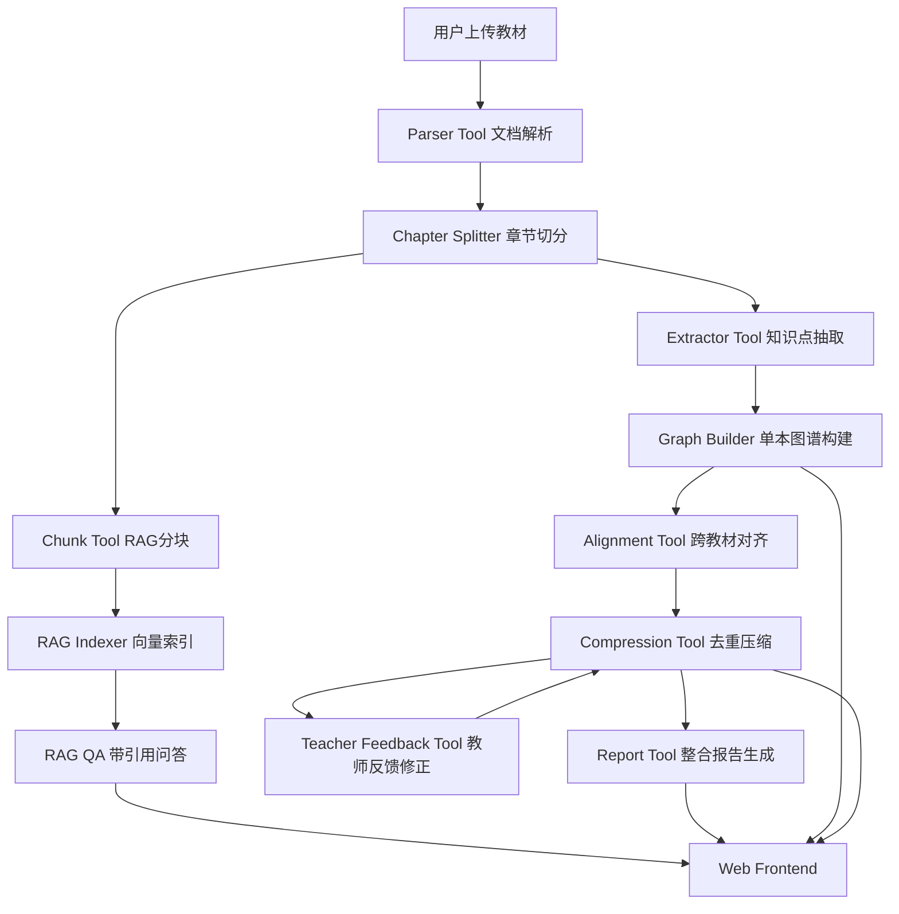

# EduGraph Agent 技术实现路径与设计方案

> 项目定位：面向多教材整合的轻量 GraphRAG 智能体工作台  
> 适用场景：AI 全栈极速黑客松 / 5 小时开发赛事 / 教材知识图谱与 RAG 系统原型

---

## 1. 项目目标

本项目不是单纯的 RAG 问答系统，也不是重型知识图谱平台，而是一个围绕“多教材知识整合”的完整工程闭环：

```text
多教材上传
→ 文档解析与章节切分
→ LLM 抽取知识点和关系
→ 构建单本教材知识图谱
→ 跨教材语义对齐与去重
→ 生成整合决策和压缩统计
→ 基于原文 Chunk 做 RAG 问答
→ 教师对话修正整合结果
→ 输出整合报告
```

最终系统应完成以下核心能力：

1. 支持多本教材上传与解析。
2. 支持 PDF、Markdown、TXT，尽量支持 DOCX。
3. 自动构建每本教材的知识图谱。
4. 能够跨教材识别重复、互补和缺失知识点。
5. 能够输出 merge / keep / remove 等整合决策。
6. 能够显示整合前后节点数、关系数和压缩比。
7. 能够基于教材原文进行 RAG 问答，并给出引用来源。
8. 支持教师通过自然语言反馈修改整合方案。
9. 能够生成 Markdown 格式整合报告。
10. 提供 Web 页面、GitHub 仓库和公网部署链接。

---

## 2. 开源参考与裁剪逻辑

本项目可以参考开源项目的成熟思路。本文档不因为人类协作者的学习曲线，就把某条更强的技术路线定义为不可行。

这里的核心原则是：

```text
只要 Claude / Codex 能稳定实现、验证、部署，并且该方案在评分、演示效果或工程质量上更优，
就可以直接采用。
```

因此，本文档区分的是：

```text
1. 默认保底路线：最容易稳定交付的方案
2. 可直接采用的高配路线：只要 Agent 能在当前时限内做成，就不需要因为人类协作者不熟悉而降级
```

路线取舍依据是：

```text
1. Claude / Codex 是否能在当前仓库中稳定落地
2. 是否能带来更高的评分收益或演示收益
3. 是否能在比赛时长内完成实现、联调和验证
4. 是否会破坏系统的可复现性和部署稳定性
```

轻量路线的作用是提供一条保底闭环，不是给更好的方案设限。

### 2.1 Neo4j LLM Graph Builder

参考价值：

```text
文档上传
→ 文本解析
→ LLM 抽取节点与关系
→ 构建知识图谱
→ 图谱可视化
```

裁剪方式：

```text
Neo4j 图数据库  →  JSON Graph + SQLite
Neo4j 可视化    →  ECharts Graph / Cytoscape.js
复杂 Graph DB   →  轻量本地数据结构
```

Neo4j 在本文档中被列为保底方案之外的可选路线。原因不是“你学不会”或“Agent 做不到”，而是它会增加部署、连接、数据迁移和前后端联调成本。

但如果 Claude / Codex 已经能稳定接管图数据库接入、数据导入和前端联调，并且预计它能显著提升图谱查询、演示效果或架构说服力，那么可以直接采用 Neo4j 方案，不需要因为人类协作者不熟悉而回避。

---

### 2.2 LightRAG / GraphRAG

参考价值：

```text
文档索引
知识图谱探索
图结构辅助检索
RAG 问答
```

裁剪方式：

```text
完整 GraphRAG 框架 → 轻量 GraphRAG 思路
图数据库检索       → JSON Graph + 向量检索
复杂社区发现       → 知识点关系图 + 概念辅助解释
```

文档中可以表述为：

> 本系统参考 LightRAG / GraphRAG 的图增强检索思想，但考虑到比赛时长和部署稳定性，采用轻量 JSON Graph 与 FAISS / Chroma 向量库实现。

---

### 2.3 kg-gen

参考价值：

```text
文本 → 实体/概念 → 关系 → 知识图谱
```

本项目不应抽取通用三元组：

```text
实体A - related_to - 实体B
```

而应抽取教育知识图谱关系：

```text
知识点A - prerequisite - 知识点B
知识点A - contains - 知识点B
知识点A - parallel - 知识点B
知识点A - applies_to - 知识点B
```

---

### 2.4 EDUKG

参考价值：

```text
学科
课程
章节
知识点
定义
例题
知识点关系
```

本项目可简化为：

```text
Textbook 教材
Chapter 章节
Concept 知识点
Definition 定义
Relation 关系
Source 原文来源
```

---

### 2.5 开源代码复用边界

原则：

> 可以参考开源项目的架构思想、技术路线和非核心实现，但不能将“本项目的核心价值链”直接替换为 GitHub 上现成仓库。

允许直接使用的内容：

```text
1. FastAPI / React / Vite 项目脚手架
2. ECharts / Cytoscape.js 的官方示例或基础配置
3. PyMuPDF、python-docx、FAISS、Chroma、rapidfuzz 等通用库
4. 通用上传组件、状态轮询、样式模板、部署脚本
5. 与业务无强绑定的小工具函数，例如 JSON repair、文件类型判断、文本清洗
```

允许参考后自行改写的内容：

```text
1. PDF 章节切分规则
2. 知识点抽取 prompt 模板
3. 图谱前端渲染逻辑
4. RAG 检索与引用展示流程
5. demo 数据和报告模板
```

必须自己实现的核心逻辑：

```text
1. 多教材知识点 schema 设计
2. 跨教材对齐策略与阈值
3. merge / keep / remove / split / restore 决策逻辑
4. 教师反馈驱动的决策修改闭环
5. 压缩比统计口径与教学完整性保护规则
6. 整合报告中的关键结论与案例分析
```

不建议直接搬运的做法：

```text
1. 直接将某个 GraphRAG / Neo4j 仓库作为项目主体
2. 整段复制对齐算法、RAG pipeline 或图谱整合代码后仅改变量名
3. 将 LLM prompt、决策规则、图谱 schema 全部照搬
4. 复制受 GPL / AGPL 等强约束协议影响的核心源码而不处理许可证问题
```

实施建议：

```text
1. 优先“装依赖”而不是“复制源码”。
2. 优先看文档和示例后自己实现关键逻辑。
3. 真要借用代码，只借非核心模块，并保留来源说明。
4. 在 README 中单独列出 References / Acknowledgements，写清楚参考了什么、裁剪了什么、自己实现了什么。
```

这样做的目标不是避免使用开源，而是确保评审能够明确看到：

```text
项目的工程闭环由你们搭建，
核心算法判断由你们设计，
开源项目提供的是加速，不是替代。
```

---

### 2.6 Coding Agent 技术决策协议

本项目允许 Claude / Codex 主动选择比保底路线更强的实现方案。判断标准不是人类协作者是否熟悉，而是 Agent 是否能在当前时间内稳定交付。

Agent 选择高配方案时，必须同时给出：

```text
1. 采用理由：它比保底方案强在哪里
2. 预期收益：对应哪些评分项、演示效果或工程质量
3. 实现边界：本阶段具体做到哪里，不扩散到无关重构
4. 验证方式：用什么命令、接口或页面证明它可运行
5. 回退方案：如果接入失败，如何退回保底实现
```

采用高配方案的条件：

```text
1. 不影响上传、解析、图谱、整合、RAG、反馈、报告这条主链路
2. 不显著增加部署失败概率
3. 不要求人类协作者临场学习复杂运维
4. Agent 能完成代码、配置、文档和最小验证
```

如果这些条件成立，应优先选择收益更高的方案，而不是因为人类协作者不熟悉而降级。

---

## 3. 总体架构设计

推荐架构：

> Controller Agent + Deterministic Tools + Lightweight GraphRAG

设计原则：

```text
LLM 负责不确定性任务：
- 知识点抽取
- 知识点关系判断
- 跨教材等价性复核
- 整合理由生成
- 教师反馈意图解析
- RAG 回答生成
- 报告生成

确定性代码负责稳定工程任务：
- 文件解析
- 文本分块
- 数据库存储
- 图谱构建
- 向量检索
- 相似度计算
- 压缩比统计
- 图谱状态更新
```

这种架构被设为默认路线，是因为它对 Claude / Codex 来说更容易稳定交付：工具边界清晰、状态可落盘、错误可局部重试。

但这不是能力上限。如果 Claude / Codex 能在当前时间内稳定实现完全自治的多 Agent、图数据库或更强的 GraphRAG 方案，而且收益明确，那么这些方案都可以直接替代默认路线。

---

## 4. 系统架构图



---

## 5. 推荐技术栈

### 5.1 前端

```text
React
Vite
TypeScript
ECharts Graph 或 Cytoscape.js
Ant Design / Tailwind CSS
Axios
Zustand 可选
```

优先推荐 ECharts Graph。

原因：

```text
1. 接入快。
2. 配置简单。
3. 支持节点颜色、大小、tooltip。
4. 支持拖拽、缩放、点击事件。
5. 黑客松展示效果足够。
```

---

### 5.2 后端

```text
Python
FastAPI
Pydantic
SQLAlchemy
SQLite
Uvicorn
```

选择理由：

```text
1. FastAPI 适合快速开发 API。
2. Python 生态适合 PDF 解析、Embedding、FAISS。
3. SQLite 足够支撑比赛数据。
4. 不需要额外部署数据库服务。
```

---

### 5.3 文件解析

```text
PDF: PyMuPDF
Markdown: pathlib + 正则
TXT: pathlib + 正则
DOCX: python-docx
Excel: pandas，可选
```

---

### 5.4 向量检索

```text
FAISS：轻量、快速、适合本地
ChromaDB：持久化更友好
```

优先推荐 FAISS。原因是集成更简单，不需要额外服务。

---

### 5.5 Embedding

可选方案：

```text
bge-small-zh
paraphrase-multilingual-MiniLM-L12-v2
OpenAI Embedding API
Qwen Embedding API
```

如果部署环境不能稳定支持本地模型，可以直接使用 API embedding。

---

### 5.6 LLM

建议统一封装 OpenAI-compatible API：

```text
BASE_URL
API_KEY
MODEL_NAME
EMBEDDING_MODEL
```

这样可以在 DeepSeek、Qwen、OpenAI 或其他兼容接口之间切换。

---

### 5.7 模块路线分级

每个核心模块都按“保底路线 / 可升级路线 / 回退路线”执行。Coding Agent 可以直接采用可升级路线，但需要满足第 2.6 节的决策协议。

```text
模块              保底路线                         可升级路线                                  回退路线
文件解析          PyMuPDF + 正则章节识别             PyMuPDF 字体/版面分析 + 目录页辅助识别        整本书作为默认章节
图谱存储          SQLite + JSON Graph               Neo4j / Kuzu / DuckDB 图关系查询              SQLite 表 + 本地 JSON 缓存
图谱可视化        ECharts Graph                     Cytoscape.js / AntV G6 多视图交互              静态 graph JSON + 基础节点详情
知识抽取          OpenAI-compatible LLM + JSON       few-shot prompt + JSON schema repair + 批处理  demo graph fallback
跨教材对齐        rapidfuzz + embedding 相似度       embedding 聚类 + LLM 复核 + 别名表             仅按名称和关键词合并
RAG               FAISS top-k 检索                   BM25 + 向量混合检索 + rerank                  关键词检索 + 原文引用
Agent 编排        Controller Agent + tools           LangGraph 多节点工作流                        顺序 pipeline
报告生成          Markdown 模板 + 统计数据            自动案例挑选 + 图表 + benchmark 数据          手工模板填充系统统计
部署              前后端分离本地运行                 Docker Compose / 云端一键部署                 只部署可演示前端 + 本地后端
```

执行规则：

```text
1. 如果可升级路线能稳定交付，就直接采用。
2. 如果可升级路线卡住主链路，立即回退到保底路线。
3. 回退不是失败，而是保证最终提交可运行。
4. 文档中记录最终采用的路线和放弃原因。
```

---

## 6. 项目目录结构

```text
edugraph-agent/
├── backend/
│   ├── app/
│   │   ├── main.py
│   │   ├── config.py
│   │   ├── database.py
│   │   ├── models/
│   │   │   ├── textbook.py
│   │   │   ├── chapter.py
│   │   │   ├── chunk.py
│   │   │   ├── graph.py
│   │   │   ├── decision.py
│   │   │   └── chat.py
│   │   ├── schemas/
│   │   ├── routers/
│   │   │   ├── textbooks.py
│   │   │   ├── graph.py
│   │   │   ├── integration.py
│   │   │   ├── rag.py
│   │   │   ├── feedback.py
│   │   │   └── report.py
│   │   ├── services/
│   │   │   ├── parser_service.py
│   │   │   ├── chunk_service.py
│   │   │   ├── llm_service.py
│   │   │   ├── graph_service.py
│   │   │   ├── alignment_service.py
│   │   │   ├── compression_service.py
│   │   │   ├── rag_service.py
│   │   │   ├── feedback_service.py
│   │   │   └── report_service.py
│   │   ├── agents/
│   │   │   └── controller_agent.py
│   │   └── utils/
│   │       ├── json_repair.py
│   │       ├── text_cleaner.py
│   │       └── similarity.py
│   ├── data/
│   │   ├── uploads/
│   │   ├── indexes/
│   │   ├── reports/
│   │   └── demo/
│   ├── requirements.txt
│   └── .env.example
│
├── frontend/
│   ├── src/
│   │   ├── api/
│   │   ├── components/
│   │   │   ├── UploadPanel.tsx
│   │   │   ├── TextbookList.tsx
│   │   │   ├── GraphView.tsx
│   │   │   ├── NodeDetailPanel.tsx
│   │   │   ├── DecisionPanel.tsx
│   │   │   ├── RagPanel.tsx
│   │   │   ├── FeedbackPanel.tsx
│   │   │   └── ReportPanel.tsx
│   │   ├── pages/
│   │   │   └── Workspace.tsx
│   │   ├── stores/
│   │   ├── types/
│   │   └── main.tsx
│   ├── package.json
│   └── .env.example
│
├── docs/
│   ├── 需求分析.md
│   ├── 系统设计.md
│   ├── Agent架构说明.md
│   └── 接口文档.md
│
├── report/
│   └── 整合报告.md
│
├── README.md
├── .gitignore
├── docker-compose.yml
└── CLAUDE.md
```

---

## 7. 核心数据结构

### 7.1 Textbook

```json
{
  "textbook_id": "book_01",
  "filename": "教材A.pdf",
  "title": "教材A",
  "file_type": "pdf",
  "total_pages": 128,
  "total_chars": 56000,
  "status": "parsed"
}
```

---

### 7.2 Chapter

```json
{
  "chapter_id": "book_01_ch_001",
  "textbook_id": "book_01",
  "title": "第一章 绪论",
  "page_start": 1,
  "page_end": 12,
  "content": "...",
  "char_count": 5300
}
```

---

### 7.3 Chunk

```json
{
  "chunk_id": "book_01_ch_001_chunk_003",
  "textbook_id": "book_01",
  "textbook_title": "教材A",
  "chapter_id": "book_01_ch_001",
  "chapter_title": "第一章 绪论",
  "page_start": 3,
  "page_end": 4,
  "content": "...",
  "char_count": 720
}
```

---

### 7.4 KnowledgeNode

```json
{
  "id": "book01_node_001",
  "name": "梯度",
  "definition": "梯度表示函数在某点增长最快方向的向量。",
  "category": "核心概念",
  "chapter": "多元函数微分学",
  "page": 35,
  "textbook": "教材A",
  "frequency": 3,
  "importance": 0.92,
  "keywords": ["方向导数", "偏导数", "等值面"]
}
```

---

### 7.5 KnowledgeEdge

```json
{
  "source": "book01_node_001",
  "target": "book01_node_002",
  "relation_type": "prerequisite",
  "description": "理解梯度需要先掌握方向导数。"
}
```

关系类型建议固定为：

```text
prerequisite 前置依赖
parallel 并列关系
contains 包含关系
applies_to 应用关系
duplicate 重复关系
complement 互补关系
```

---

### 7.6 IntegrationDecision

```json
{
  "decision_id": "merge_001",
  "action": "merge",
  "affected_nodes": [
    "book01_node_003",
    "book02_node_014"
  ],
  "result_node": "merged_node_001",
  "reason": "两个节点均解释梯度的方向意义，教材B补充了模长含义，因此保留教材B定义并吸收教材A表述。",
  "confidence": 0.91,
  "status": "accepted"
}
```

决策类型：

```text
merge 合并重复知识点
keep 保留唯一或关键知识点
remove 删除冗余知识点
split 教师反馈后拆分
restore 教师反馈后恢复
```

---

## 8. 后端模块设计

### 8.1 Parser Service

职责：

```text
1. 接收上传文件。
2. 识别文件类型。
3. 提取正文。
4. 识别章节。
5. 过滤明显页眉页脚。
6. 生成 Textbook + Chapter 结构。
```

实现策略：

```text
PDF:
- 使用 PyMuPDF 逐页解析。
- 保存页码信息。
- 用正则识别“第X章”“Chapter X”“第X节”等标题。
- 页眉页脚先用简单规则过滤。

Markdown:
- 使用 #、##、### 识别章节。

TXT:
- 使用“第X章”“Chapter X”“一、”“1.”等正则切分。

DOCX:
- 使用 python-docx 读取段落。
- 优先识别标题样式。
- 失败则使用正则切分。
```

Fallback：

```text
如果无法识别章节，则整本书作为一个默认章节。
如果解析失败，则返回失败状态，不影响其他文件。
```

---

### 8.2 Chunk Service

职责：

```text
1. 将章节正文切成 500–800 字 chunk。
2. 相邻 chunk 保留 50–100 字 overlap。
3. 每个 chunk 保留教材名、章节名、页码等元数据。
```

推荐参数：

```text
chunk_size = 700
overlap = 100
top_k = 5
```

选择理由：

```text
700 字通常足够覆盖一个局部知识点定义、解释和例子。
100 字重叠可以降低知识点被切断的风险。
top-5 可以平衡召回率和 prompt 长度。
```

---

### 8.3 LLM Service

职责：

```text
1. 封装 OpenAI-compatible API。
2. 支持 chat completion。
3. 支持 embedding。
4. 统一错误处理。
5. 实现 JSON 解析和修复。
```

必须实现：

```text
extract_json()
repair_json()
validate_schema()
fallback_empty_result()
```

原因：

```text
LLM 输出 JSON 不稳定是高风险点。
如果没有 JSON repair，整个图谱流程容易中断。
```

---

### 8.4 Extractor Service

输入：

```text
单个章节文本
章节标题
教材名称
页码范围
```

输出：

```json
{
  "nodes": [],
  "edges": []
}
```

Prompt 约束：

```text
你是教育知识图谱构建专家。
请从给定教材章节中抽取知识点和知识点关系。

只输出 JSON，不要输出 Markdown。
知识点类型包括：核心概念、定理、方法、公式、现象、例题、应用。
关系类型只能从以下列表选择：
prerequisite, parallel, contains, applies_to。

每个节点必须包含：
name, definition, category, chapter, page, importance, keywords。

每条边必须包含：
source_name, target_name, relation_type, description。

不要引入原文中不存在的知识点。
如果内容不足，返回空数组。
```

---

### 8.5 Graph Builder

职责：

```text
1. 将 LLM 输出节点保存为 KnowledgeNode。
2. 将 LLM 输出关系保存为 KnowledgeEdge。
3. 处理 source_name / target_name 到 node_id 的映射。
4. 去除同一本教材内重复节点。
5. 输出前端可渲染的 graph JSON。
```

前端图谱格式：

```json
{
  "nodes": [
    {
      "id": "book01_node_001",
      "name": "梯度",
      "symbolSize": 42,
      "category": "教材A",
      "value": 3
    }
  ],
  "links": [
    {
      "source": "book01_node_001",
      "target": "book01_node_002",
      "relation": "prerequisite"
    }
  ],
  "categories": [
    { "name": "教材A" },
    { "name": "教材B" }
  ]
}
```

---

### 8.6 Alignment Service

这是跨教材整合的核心模块。

推荐三层策略：

```text
第一层：规则对齐
- 名称完全相同。
- 去除空格、标点、大小写后相同。
- 常见中英文别名表匹配。

第二层：相似度对齐
- name similarity
- definition embedding similarity
- keyword overlap

第三层：LLM 复核
- 对高相似但不确定的候选进行等价性判断。
```

综合得分：

```text
score = 0.4 * name_similarity
      + 0.4 * definition_similarity
      + 0.2 * keyword_overlap
```

阈值建议：

```text
score > 0.88：自动 merge
0.72 < score <= 0.88：LLM 复核
score <= 0.72：keep
```

LLM 复核输出：

```json
{
  "is_equivalent": true,
  "relation": "duplicate",
  "confidence": 0.91,
  "reason": "两个知识点均描述函数在某点增长最快方向的向量，含义一致。"
}
```

---

### 8.7 Compression Service

职责：

```text
1. 根据 Alignment 结果生成 merge / keep / remove 决策。
2. 合并重复知识点。
3. 删除低重要度冗余节点。
4. 保留核心概念和前置依赖节点。
5. 计算压缩比。
```

压缩比计算：

```text
原始体量 = 所有教材 total_chars 之和
整合后体量 = 所有保留节点 definition + explanation + source_summary 的字符数
压缩比 = 整合后体量 / 原始体量
```

压缩策略：

```text
1. 所有核心节点必须保留。
2. 重复节点合并为一个。
3. 低重要度且非前置依赖节点删除。
4. 对定义和解释做摘要压缩。
5. 如果压缩比仍 > 30%，继续压缩扩展节点。
```

教学完整性保护：

```text
1. 不删除被其他节点 prerequisite 指向的节点。
2. 不删除多本教材都出现的高频核心概念。
3. 删除节点前检查是否会导致学习路径断裂。
```

---

### 8.8 RAG Service

RAG Pipeline：

```text
教材章节
→ chunk 分块
→ embedding
→ FAISS / Chroma 建索引
→ 用户问题 embedding
→ top-k 检索
→ 构造 prompt
→ LLM 回答
→ 返回 citations 和 source_chunks
```

返回结构：

```json
{
  "answer": "梯度表示多元函数在某一点增长最快方向的向量，其方向对应最大方向导数。",
  "citations": [
    {
      "textbook": "教材A",
      "chapter": "第三章 多元函数微分学",
      "page": 35,
      "relevance_score": 0.91
    }
  ],
  "source_chunks": [
    {
      "chunk_id": "book01_ch03_chunk002",
      "content": "...",
      "score": 0.91
    }
  ]
}
```

RAG Prompt：

```text
你是一个教材问答助手。
你只能基于给定上下文回答问题，不允许使用外部知识。
每个关键结论后必须标注来源，格式为：[教材名, 章节名, 第X页]。
如果上下文中找不到答案，请回答：“当前知识库中未找到相关信息”。

上下文：
{retrieved_chunks}

问题：
{question}
```

---

### 8.9 Feedback Service

支持的教师反馈类型：

```text
1. 为什么合并 A 和 B？
2. 保留 A，不要删除。
3. 把 A 和 B 分开。
4. 把 A 和 B 合并。
```

处理流程：

```text
教师输入自然语言
→ LLM 解析为结构化 action
→ 后端修改 integration_decisions / graph
→ 重新计算压缩比和图谱统计
→ 保存对话历史
→ 前端刷新图谱或决策列表
```

结构化 action 示例：

```json
{
  "intent": "restore_node",
  "target_nodes": ["免疫应答"],
  "reason": "教师认为该知识点对后续章节重要，不应删除。"
}
```

---

### 8.10 Report Service

生成 `report/整合报告.md`。

报告应包含：

```text
1. 整合概览
2. 原始教材数量、总字数、整合后字数、压缩比
3. 合并 / 保留 / 删除决策数量
4. 整合前后节点数和关系数
5. 3–5 个重点整合案例
6. 教学完整性说明
7. 已知局限与改进方向
```

---

## 9. API 设计

### 9.1 教材接口

```text
POST   /api/textbooks/upload
GET    /api/textbooks
GET    /api/textbooks/{id}
POST   /api/textbooks/{id}/parse
```

---

### 9.2 图谱接口

```text
POST   /api/graph/extract/{textbook_id}
GET    /api/graph/{textbook_id}
GET    /api/graph/merged
```

---

### 9.3 整合接口

```text
POST   /api/integration/run
GET    /api/integration/decisions
POST   /api/integration/decisions/{id}/accept
POST   /api/integration/decisions/{id}/reject
```

---

### 9.4 RAG 接口

```text
POST   /api/rag/index
GET    /api/rag/status
POST   /api/rag/query
```

---

### 9.5 教师反馈接口

```text
POST   /api/feedback/chat
GET    /api/feedback/history
```

---

### 9.6 报告接口

```text
POST   /api/report/generate
GET    /api/report
GET    /api/report/download
```

---

### 9.7 一键流程接口

建议额外提供：

```text
POST /api/pipeline/run
```

执行：

```text
parse
→ chunk
→ extract
→ build graph
→ align
→ compress
→ index RAG
→ generate report
```

这对现场演示很重要。

---

## 10. 前端页面设计

整体采用单页工作台布局。

```text
┌────────────────────────────────────────────────────────┐
│ EduGraph Agent | 教材数 7 | Chunk数 320 | 压缩比 28.7% │
├───────────────┬─────────────────────────┬──────────────┤
│ 教材管理区      │ 知识图谱主视图             │ 功能面板       │
│               │                         │              │
│ 上传文件        │ ECharts / Cytoscape 图谱    │ Tab1 整合决策  │
│ 文件列表        │                         │ Tab2 RAG问答   │
│ 解析状态        │ 节点大小=频次              │ Tab3 教师反馈  │
│ 章节列表        │ 节点颜色=教材来源           │ Tab4 整合报告  │
│               │ 边颜色=关系类型             │              │
└───────────────┴─────────────────────────┴──────────────┘
```

必须实现的交互：

```text
1. 上传多个文件。
2. 显示文件名、格式、大小、解析状态。
3. 点击构建知识图谱。
4. 图谱可缩放、拖拽。
5. 点击节点显示详情。
6. 节点大小表示出现频次或重要度。
7. 节点颜色表示教材来源。
8. 边颜色表示关系类型。
9. 整合决策列表可查看理由。
10. RAG 问答显示引用来源。
11. 教师反馈能修改至少一条决策。
```

节点详情面板：

```text
知识点：梯度
类别：核心概念
定义：……
来源：教材A 第三章 第35页
出现频次：3
关系：
- 前置依赖：方向导数
- 应用关系：切平面
原文片段：……
```

---

## 11. 数据库表设计

SQLite 表建议：

```text
textbooks
- id
- filename
- title
- file_type
- total_pages
- total_chars
- status
- created_at

chapters
- id
- textbook_id
- title
- page_start
- page_end
- content
- char_count

chunks
- id
- textbook_id
- chapter_id
- content
- page_start
- page_end
- embedding_id

knowledge_nodes
- id
- textbook_id
- name
- definition
- category
- chapter_id
- page
- importance
- keywords_json
- status

knowledge_edges
- id
- source_id
- target_id
- relation_type
- description
- textbook_id

integration_decisions
- id
- action
- affected_nodes_json
- result_node_id
- reason
- confidence
- status

chat_messages
- id
- role
- content
- parsed_action_json
- created_at

reports
- id
- path
- summary_json
- created_at
```

---

## 12. 人类协作者与 Coding Agent 的分工

本文档默认由 Coding Agent（Claude Code / Codex）主导实现，人类协作者负责约束范围、提供环境和做最终验收。

### 12.1 人类协作者的工作

人类协作者负责：

```text
1. 确定技术路线。
2. 控制项目范围。
3. 制定验收 checklist。
4. 审核 Agent 生成的代码和文档。
5. 准备 demo 数据和 fallback 数据。
6. 提供可用环境变量、API Key 和部署目标。
7. 设计最终演示路线。
8. 确保 GitHub 和部署链接有效。
```

人类协作者不需要手写每一行代码，但需要保证项目方向不跑偏，并及时对 Agent 的阶段结果做验收。

---

### 12.2 Coding Agent 的工作

Coding Agent（Claude Code / Codex）负责：

```text
1. 初始化 monorepo。
2. 编写 FastAPI 后端。
3. 编写 React 前端。
4. 实现文件解析服务。
5. 实现 LLM 抽取服务。
6. 实现图谱构建服务。
7. 实现跨教材对齐和整合逻辑。
8. 实现 RAG 索引和问答。
9. 实现教师反馈修改。
10. 生成 README、docs 和 report 初稿。
11. 协助修复运行和部署问题。
```

---

## 13. Coding Agent 开发指令顺序

不要让 Coding Agent 一次性生成整个项目。应按阶段执行，每一阶段都必须有可运行产物和可验证输出。

每个阶段开始前，Coding Agent 需要先判断是否采用高配方案：

```text
1. 先说明本阶段默认保底方案。
2. 判断是否有更强方案值得直接采用。
3. 如果采用高配方案，说明理由、收益、验证方式和回退方案。
4. 如果不采用高配方案，说明是因为时间、部署、依赖还是收益不足。
5. 阶段结束时必须给出可运行验证结果。
```

### Step 1：初始化项目

```text
创建一个 monorepo 项目 edugraph-agent。

要求：
1. backend 使用 FastAPI + SQLAlchemy + SQLite + Pydantic。
2. frontend 使用 React + Vite + TypeScript。
3. 创建 docs 和 report 目录。
4. backend 中预留 routers、services、models、schemas、utils、agents 目录。
5. frontend 中预留 api、components、pages、types、stores 目录。
6. 写 README 初稿和 .gitignore，排除 PDF、上传文件、向量索引、.env。
```

---

### Step 2：实现教材上传和解析

```text
实现 backend 的教材上传与解析功能。

要求：
1. 支持 PDF、Markdown、TXT、DOCX。
2. PDF 使用 PyMuPDF 逐页解析。
3. Markdown 按标题切分。
4. TXT 按“第X章 / Chapter X / 1.”粗略切分。
5. 如果无法识别章节，则整本书作为一个默认章节。
6. 解析结果写入 SQLite。
7. 提供 API：
   POST /api/textbooks/upload
   GET /api/textbooks
   GET /api/textbooks/{id}
   POST /api/textbooks/{id}/parse
8. 返回结构符合 textbook / chapters schema。
```

---

### Step 3：实现 LLM 知识点抽取

```text
实现知识点抽取服务。

要求：
1. 支持 OpenAI-compatible API，通过 .env 配置 BASE_URL、API_KEY、MODEL。
2. 对每个章节调用 LLM 抽取 nodes 和 edges。
3. 使用严格 JSON prompt。
4. 实现 JSON repair 兜底。
5. 保存 knowledge_nodes 和 knowledge_edges 到 SQLite。
6. 提供 API：
   POST /api/graph/extract/{textbook_id}
   GET /api/graph/{textbook_id}
7. 返回前端可直接渲染的 graph JSON。
```

---

### Step 4：实现图谱前端

```text
实现前端图谱工作台。

要求：
1. 左侧为教材上传和文件列表。
2. 中间为 ECharts Graph 知识图谱。
3. 右侧为节点详情面板。
4. 支持点击节点展示名称、定义、章节、页码、来源、关键词。
5. 节点大小根据 frequency 或 importance 映射。
6. 节点颜色根据 textbook 映射。
7. 边 tooltip 显示 relation_type 和 description。
```

---

### Step 5：实现跨教材整合

```text
实现跨教材知识点对齐和整合。

要求：
1. 对所有教材的 knowledge_nodes 进行两两候选匹配。
2. 使用 rapidfuzz 计算 name similarity。
3. 使用 sentence-transformers 或 embedding API 计算 definition similarity。
4. 根据综合分生成候选重复节点。
5. 对不确定候选调用 LLM 判断是否等价。
6. 生成 integration_decisions。
7. 支持 merge、keep、remove 三类 action。
8. 计算整合前后节点数、关系数、压缩比。
9. 提供 API：
   POST /api/integration/run
   GET /api/integration/decisions
   GET /api/graph/merged
```

---

### Step 6：实现 RAG

```text
实现 RAG 问答功能。

要求：
1. 对所有 chapters 生成 chunks，chunk_size=700，overlap=100。
2. 每个 chunk 保存 textbook、chapter、page_start、page_end 元数据。
3. 使用 FAISS 或 Chroma 建索引。
4. 查询时检索 top_k=5。
5. LLM 回答必须只基于上下文。
6. 回答必须带引用：[教材名, 章节名, 第X页]。
7. 如果没有相关上下文，回答“当前知识库中未找到相关信息”。
8. 提供 API：
   POST /api/rag/index
   GET /api/rag/status
   POST /api/rag/query
```

---

### Step 7：实现教师反馈

```text
实现教师反馈聊天功能。

要求：
1. 支持教师询问“为什么合并A和B”。
2. 支持教师说“保留A，不要删除”。
3. 支持教师说“把A和B分开”。
4. 支持教师说“把A和B合并”。
5. 使用 LLM 将自然语言解析为 action JSON。
6. 根据 action 修改 integration_decisions 和 graph。
7. 保存对话历史。
8. 提供 API：
   POST /api/feedback/chat
   GET /api/feedback/history
```

---

### Step 8：实现报告生成

```text
实现整合报告生成。

要求：
1. 生成 report/整合报告.md。
2. 包含：
   - 整合概览
   - 原始教材数量、总字数、整合后字数、压缩比
   - 合并/保留/删除决策数量
   - 整合前后节点数和关系数
   - 3–5 个重点整合案例
   - 教学完整性说明
3. 在前端报告 Tab 中展示 Markdown。
4. 提供 API：
   POST /api/report/generate
   GET /api/report
```

---

## 14. Agent 约束文件建议内容

如果主要使用 Claude Code，可在项目根目录放置 `CLAUDE.md`；如果切换到 Codex，也应将同样的约束同步到对应的项目级 Agent 说明文件。

```md
# 项目开发约束

本项目是 AI 全栈黑客松项目：EduGraph Agent。

## 总体目标

实现多教材知识整合智能体，包含：
1. 多格式教材解析
2. 知识点抽取
3. 知识图谱可视化
4. 跨教材去重整合
5. RAG 带引用问答
6. 教师反馈修正
7. 整合报告生成

## 技术栈

- Backend: FastAPI + SQLite + SQLAlchemy + Pydantic
- Frontend: React + Vite + TypeScript + ECharts
- Vector DB: FAISS or Chroma
- LLM: OpenAI-compatible API
- Storage: SQLite + local JSON cache

## 默认约束

- 默认优先采用 FastAPI + SQLite + ECharts 的保底闭环；但如果 Claude / Codex 能稳定交付更强方案，可以直接升级实现
- Neo4j、LangChain、大型多 Agent 编排不是禁用项；只有在它们增加复杂度却没有带来明确收益时，才不应引入
- 不要把 PDF 文件提交到 Git
- 默认不改变 FastAPI + React 的主技术栈；只有在收益明确且能稳定迁移时才调整
- 不要生成无法运行的复杂架构
- 不要让 LLM 输出自由文本作为核心数据结构

## 技术路线决策

- 不能因为人类协作者不熟悉某项技术，就把该技术判定为不可行
- 如果更强方案能由 Claude / Codex 稳定实现、验证、部署，并且收益明确，可以直接采用
- 采用高配方案时必须说明采用理由、预期收益、验证方式和回退方案
- 如果高配方案影响主链路交付，应立即回退到保底路线
- 最终 README 和 Agent 架构说明需要记录实际采用的路线、放弃的路线和原因

## 数据结构优先

核心对象：
- Textbook
- Chapter
- Chunk
- KnowledgeNode
- KnowledgeEdge
- IntegrationDecision
- ChatMessage
- Report

## 代码要求

- 所有 API 返回明确 JSON
- 所有 LLM 输出必须做 JSON parse 和 fallback
- 所有长任务都要返回状态
- 前端必须支持 demo 数据 fallback
```

---

## 15. 竞赛当天时间分配

```text
第 0–30 分钟：
初始化项目、配置前后端、准备 demo 数据、先部署空页面。

第 30–90 分钟：
实现上传、解析、章节切分。

第 90–150 分钟：
实现 LLM 知识点抽取和单本图谱可视化。

第 150–210 分钟：
实现跨教材对齐、整合决策、压缩比统计。

第 210–250 分钟：
实现 RAG 索引和带引用问答。

第 250–275 分钟：
实现教师反馈修改决策。

第 275–300 分钟：
生成报告、补 README、检查部署、提交 GitHub 和部署链接。
```

---

## 16. 最小可交付版本

必须完成：

```text
1. PDF / MD / TXT 上传解析
2. 章节结构识别
3. LLM 抽取知识点 nodes / edges
4. 单本教材图谱可视化
5. 跨教材重复知识点 merge
6. 整合决策列表
7. 压缩比 <= 30%
8. RAG 问答 + 引用来源
9. 教师反馈修改一条决策
10. 整合报告
11. README + docs/Agent架构说明.md
12. 在线部署
```

---

## 17. P1 加分方向

有余力再做：

```text
1. DOCX / Excel 支持
2. 图谱搜索
3. 整合前后对比图
4. BM25 + 向量混合检索
5. RAG benchmark
6. Token 消耗统计
7. PDF 报告导出
8. Docker Compose
```

---

## 18. P2 技术报告方向

最容易写且能做出数据的方向：

> 不同 chunk size 对 RAG 引用准确率的影响

实验设计：

```text
chunk_size = 300 / 500 / 800 / 1200
问题数 = 20
指标：
- top-5 命中率
- 引用准确率
- 平均响应时间
- token 消耗
```

也可以做：

```text
1. 向量检索 vs BM25 + 向量混合检索
2. 不同知识点对齐阈值对 merge 准确率的影响
3. 不同 prompt 模板对知识点抽取质量的影响
4. 普通 RAG vs 图谱辅助 RAG 的引用准确率对比
```

---

## 19. 最终演示路线

建议演示流程：

```text
1. 打开 EduGraph Agent 工作台。
2. 上传两本或多本教材。
3. 展示解析后的教材列表和章节结构。
4. 点击“构建知识图谱”。
5. 展示单本教材知识图谱。
6. 切换到“整合图谱”。
7. 展示重复知识点合并决策。
8. 展示压缩比统计。
9. 在 RAG 问答中提问一个教材问题。
10. 展示回答正文和引用来源。
11. 在教师反馈中输入：“保留某知识点，不要删除”。
12. 展示整合决策或图谱发生变化。
13. 打开整合报告。
14. 展示 README 和 Agent 架构说明。
```

---

## 20. 关键风险与规避

### 20.1 PDF 解析不稳定

规避：

```text
1. 允许整本书作为默认章节。
2. 保留原始正文。
3. 提供 demo 数据 fallback。
```

---

### 20.2 LLM JSON 输出不稳定

规避：

```text
1. 强制 JSON prompt。
2. 实现 JSON repair。
3. schema validation。
4. fallback_empty_graph。
```

---

### 20.3 RAG 回答没有引用

规避：

```text
1. 每个 chunk 必须保留元数据。
2. Prompt 中强制引用格式。
3. 前端单独展示 citations。
```

---

### 20.4 Claude 过度设计

规避：

```text
1. 用 CLAUDE.md 固定技术栈。
2. 明确不要 Neo4j / LangChain 大框架。
3. 按阶段任务推进。
4. 每完成一步立即运行测试。
```

---

### 20.5 部署失败

规避：

```text
1. 第 2 小时前先部署空页面。
2. 后端使用 SQLite，减少数据库部署成本。
3. .env.example 写清楚环境变量。
4. 不上传 PDF 到 GitHub。
```

---

## 21. 最终总结

本项目最合理的实现策略不是复刻一个完整的教育知识图谱平台，而是构建一个轻量、可部署、可解释、可演示的教材 GraphRAG 工作台。

核心技术路线：

```text
React + FastAPI + SQLite + JSON Graph + FAISS + OpenAI-compatible LLM
```

核心设计原则：

```text
1. 图谱用 JSON Graph，不上重型图数据库。
2. 检索用 FAISS / Chroma，不自己造向量库。
3. LLM 输出必须结构化 JSON。
4. 所有关键步骤都有 fallback。
5. 前端图谱一定要好看、可点、可解释。
6. RAG 回答必须带来源。
7. 教师反馈只做有限指令，不做完全自由 Agent。
8. 文档里重点解释架构取舍。
```

一句话概括：

> 参考 Neo4j LLM Graph Builder 的文档图谱构建流程，参考 LightRAG / GraphRAG 的图增强检索思想，但实现上采用 React + Graphin + FastAPI + SQLite + TF-IDF + FAISS + GLM-4-flash 的轻量工程方案，在 5 小时内完成”教材解析—知识图谱—跨教材整合—RAG 引用问答—教师反馈—报告生成”的完整闭环。

---

## 附录 A：环境实测结论

以下数据来自对当前开发环境的实际验证，直接影响技术选型决策。

### A.1 运行环境

```text
平台:        Windows 11 Home China 10.0.26200
Python:      3.13.13 (64-bit)
Node.js:     24.14.1
npm:         11.11.0
```

### A.2 已安装的关键包

```text
PyMuPDF      1.26.7
FastAPI      0.135.1
Pydantic     2.12.5
scikit-learn 1.8.0
numpy        2.4.2
torch        2.10.0+cpu
uvicorn      0.41.0
httpx        0.28.1
```

### A.3 需要额外安装的包

```text
faiss-cpu
python-multipart
aiofiles
pydantic-settings
sqlalchemy
```

### A.4 LLM 实测结论

```text
平台:        阿里百炼（DashScope）
API 端点:    https://dashscope.aliyuncs.com/compatible-mode/v1/chat/completions
API Key:     sk-***REDACTED***
认证方式:    Bearer Token
JSON Mode:   支持 response_format: {“type”: “json_object”}
```

主模型: qwen3.6-flash

```text
模型:        qwen3.6-flash
免费额度:    1,000,000 tokens（到期 2026/07/17，最充裕）
特点:        thinking 模型，支持 enable_thinking: False 关闭推理
JSON Mode:   支持
Token 消耗:  thinking 关闭时 ~33 tokens/简单调用；thinking 开启时 ~505 tokens/简单调用
用途:        全部 LLM 任务（知识点抽取、对齐判断、整合决策、RAG 问答、对话）
```

备用模型（额度较小，按需选用）:

```text
qwen3.5-flash:      1,000,000 tokens（到期 2026/05/25）
qwen3.5-plus:       1,000,000 tokens（到期 2026/05/18）
glm-5:              907,416 tokens（到期 2026/05/18）
glm-5.1:            有额度
```

Thinking 模式策略（按任务开关）:

```text
知识点抽取:     thinking OFF → 只要结构化 JSON，不需要推理（~33 tokens）
跨教材对齐:     thinking ON  → 推理有助于判断概念等价性
整合决策:       thinking ON  → 推理有助于做出 merge/keep/remove 判断
RAG 问答:       thinking OFF → 直接回答 + 引用，不需要推理
教师对话:       thinking ON  → 推理有助于理解教师意图
```
```

### A.5 Embedding 实测结论

```text
模型:        text-embedding-v3（阿里百炼）
API 端点:    https://dashscope.aliyuncs.com/compatible-mode/v1/embeddings
维度:        1024
批量支持:    支持（一次可传多个 input）
Token 消耗:  极低（5 个短语仅 11 tokens）
中文支持:    优秀
状态:        已验证可用
```

决策：使用 text-embedding-v3 作为向量化方案，放弃 TF-IDF。这直接提升跨教材对齐和 RAG 检索质量。

### A.6 PDF 教材实测结论

```text
总大小:         ~826MB
类型:           全部为文本 PDF（非扫描件）
PyMuPDF 可提取: 是

书签情况:
  01_局部解剖学    305 页  无书签  → 需要 TOC 正则 fallback
  02_组织学与胚胎学 319 页  365 书签 → fitz.get_toc() 直接提取
  03_生理学        450 页  303 书签 → fitz.get_toc() 直接提取
  04_医学微生物学  386 页  211 书签 → fitz.get_toc() 直接提取（多一层”篇”级）
  05_病理学        418 页  446 书签 → fitz.get_toc() 直接提取
  06_传染病学      398 页  无书签  → 需要 TOC 正则 fallback
  07_病理生理学    291 页  349 书签 → fitz.get_toc() 直接提取

章节命名规律:
  统一格式: 第X章 → 第X节 → 一、→ (一)→ 1.
  正则匹配: 第[一二三四五六七八九十]+章
  04号额外有: 第一篇 → 第一章（多一层层级）
```

---

## 附录 B：技术选型定稿

基于环境实测，对第 5 节推荐技术栈的最终确认和修正。

### B.1 确认的选型

| 层级 | 原设计 | 最终选型 | 修正原因 |
|------|--------|---------|---------|
| 前端框架 | React + Vite + TypeScript | **React + Vite + JavaScript** | 5小时比赛 TypeScript 增加类型编写时间，JS 更快 |
| 图谱可视化 | ECharts Graph / Cytoscape.js | **@antv/graphin (G6 React 封装)** | 赛题要求”拖拽单个节点”，Graphin 原生支持；几百节点性能更好 |
| 辅助图表 | 同上 | **ECharts** | 压缩比统计、决策分布等辅助图表 |
| UI 框架 | Ant Design / Tailwind CSS | **Ant Design** | 组件丰富，中文支持好 |
| 后端框架 | FastAPI + Pydantic | **FastAPI + Pydantic** | 不变 |
| 数据库 | SQLite + SQLAlchemy | **SQLite + SQLAlchemy** | 不变，更工程化 |
| 文件解析 | PyMuPDF | **PyMuPDF** | 不变 |
| 向量检索 | FAISS | **FAISS** | 不变 |
| Embedding | bge-small-zh / API | **text-embedding-v3 (阿里百炼)** | 1024维，中文优秀，批量支持，token 消耗极低 |
| LLM | OpenAI-compatible 多选 | **qwen3.6-flash（阿里百炼免费）** | 1M tokens，支持 JSON mode，可开关 thinking |

### B.2 Embedding 方案说明

使用阿里百炼 text-embedding-v3 作为向量化方案：

```text
API:    https://dashscope.aliyuncs.com/compatible-mode/v1/embeddings
模型:   text-embedding-v3
维度:   1024
批量:   支持一次传入多个 input
用途:   跨教材语义对齐 + RAG 检索

检索:   FAISS IndexFlatIP（L2 归一化后内积 = 余弦相似度）
阈值:   对齐用 0.85（dense embedding 的余弦相似度阈值）
RAG:    top-5 检索
```

备选：sklearn TF-IDF（如果 API 调用受限，可降级为本地 TF-IDF，阈值调整为 0.35）。

### B.3 Graphin 集成方案

赛题要求的全部图谱交互通过 @antv/graphin 实现：

```jsx
// 核心数据转换：后端 KG → Graphin 格式
const TEXTBOOK_COLORS = [
  '#5B8FF9', '#5AD8A6', '#F6BD16', '#E86452',
  '#6DC8EC', '#945FB9', '#FF9845'
];

function transformForGraphin(kgData) {
  const colorMap = {};
  let colorIdx = 0;
  kgData.nodes.forEach(n => {
    if (!(n.textbook_id in colorMap)) {
      colorMap[n.textbook_id] = TEXTBOOK_COLORS[colorIdx++ % TEXTBOOK_COLORS.length];
    }
  });

  return {
    nodes: kgData.nodes.map(n => ({
      id: n.id,
      style: {
        keyShape: {
          size: Math.max(20, 10 + n.frequency * 10),  // 频次 → 大小
          fill: colorMap[n.textbook_id] || '#999',      // 教材 → 颜色
          stroke: '#fff',
        },
        label: { value: n.name },
      },
      data: n,
    })),
    edges: kgData.edges.map(e => ({
      source: e.source,
      target: e.target,
      style: { keyShape: { stroke: '#aaa', lineWidth: e.strength * 2 } },
      label: e.relation_type,
      data: e,
    })),
  };
}
```

赛题交互需求覆盖：

```text
1. 节点点击弹出详情 → Graphin 的 onNodeClick + NodeDetail 面板
2. 频次映射大小     → keyShape.size = 10 + frequency * 10
3. 颜色区分教材     → keyShape.fill = TEXTBOOK_COLORS[textbook_id]
4. 鼠标缩放拖拽     → Graphin 内置 behavior（ZoomCanvas, DragCanvas, DragNode）
5. 搜索高亮         → graph.setItemState(node, 'highlight', true)
```

---

## 附录 C：跨教材对齐算法定稿

对第 8.6 节 Alignment Service 的算法补充。

### C.1 两阶段对齐流程

```text
Pass 1: Dense Embedding 相似度（text-embedding-v3，1024维）

  输入: 所有教材的所有 KnowledgeNode
  处理:
    1. 对每个节点，构造文本 = name + “ “ + definition
    2. 调用 text-embedding-v3 批量向量化（每批 20-50 个节点）
    3. 计算所有节点对的 cosine_similarity
    4. 只保留跨教材对（textbook_id 不同）
    5. 阈值 >= 0.85 的对进入候选列表
  输出: 候选对列表 [(node_i, node_j, similarity_score)]

Pass 2: LLM 精确判断（qwen3.6-flash，thinking ON）

  输入: Pass 1 的候选对（按相似度降序排列）
  处理:
    1. 取 top-200 候选对（控制 API 调用量）
    2. 每对调用一次 LLM，传入 name, definition, textbook_id, chapter
    3. LLM 返回: {“judgment”: “same/different”, “confidence”: 0.0-1.0, “reason”: “...”}
    4. same 且 confidence >= 0.7 → 确认为等价
    5. 用 Union-Find 数据结构构建传递闭包
  输出: 等价组列表 [[node_id_1, node_id_2, ...], ...]
```

### C.2 阈值说明

```text
Embedding 阈值 0.85 的选择依据:
  text-embedding-v3 是 1024维 dense embedding
  同一概念的别名（如”白细胞”vs”leukocyte”）相似度通常 > 0.85
  高度相似但不同概念（如”免疫细胞”vs”T细胞”）相似度通常 0.70-0.84
  0.85 可以覆盖大部分真实重复，Pass 2 的 LLM 判断会过滤误报

LLM 阈值 0.7 的选择依据:
      >= 0.7: 高置信度等价，自动 merge
  0.5 - 0.7: 中等置信度，可在前端标记为”待确认”
      < 0.5: 不等价，各自 keep
```

### C.3 综合得分公式

使用 text-embedding-v3 dense embedding：

```text
score = 0.4 * name_embedding_similarity
      + 0.4 * definition_embedding_similarity
      + 0.2 * keyword_overlap（Jaccard similarity）
```

实际实现中可简化为直接用 `cosine_similarity(name + " " + definition)` 的单一分数，配合 Pass 2 LLM 判断。

---

## 附录 C+：Thinking 模式开关设计

qwen3.6-flash 支持 `enable_thinking` 参数。设计为全局配置 + 任务级覆盖：

```python
# config.py 中的 Thinking 策略配置
THINKING_CONFIG = {
    "extraction": False,    # 知识点抽取：只要 JSON，不需要推理
    "alignment": True,      # 对齐判断：推理有助于判断等价性
    "integration": True,    # 整合决策：推理有助于 merge/keep/remove
    "rag_qa": False,        # RAG 问答：直接回答 + 引用
    "dialogue": True,       # 教师对话：推理有助于理解意图
}

# llm.py 中的实现
async def chat(self, messages, json_mode=False, thinking=None, max_tokens=None):
    payload = {
        "model": self.model,
        "messages": messages,
        "max_tokens": max_tokens or self.max_tokens,
    }
    if json_mode:
        payload["response_format"] = {"type": "json_object"}
    if thinking is not None:
        payload["enable_thinking"] = thinking
    ...
```

短期赛事中 thinking ON/OFF 的取舍：

```text
优势: thinking ON 的输出质量明显更高，尤其是对齐判断和整合决策
劣势: 每次调用消耗 ~500 额外 tokens
结论: 1,000,000 tokens 额度足够支撑全部任务，可以放心开启 thinking
      但对知识点抽取这种只需要结构化 JSON 的任务，关闭 thinking 更快更省
      设计开关让你可以按任务灵活调整
```

---

## 附录 D+：P1 加分项策略

P1 加分项不做硬性要求，但实现后会获得额外加分。以下按性价比排序（投入时间 vs 评分收益）：

### D+.1 高性价比 P1 项（建议做）

| P1 项 | 预计时间 | 评分收益 | 实现方式 |
|---|---|---|---|
| **Docker 一键部署** | 20min | E维度进阶分 | 写 Dockerfile + docker-compose.yml |
| **Token 消耗统计** | 15min | 多维度加分 | llm.py 里累计 token 数，前端 ECharts 展示 |
| **混合检索（向量 + BM25）** | 30min | RAG 维度进阶分 | sklearn BM25 + embedding 向量检索，加权合并 |
| **自建 RAG Benchmark** | 30min | 多维度显著加分 | 编写 20 个测试问题 + 预期答案，自动评测 |

### D+.2 中等性价比 P1 项（有余力做）

| P1 项 | 预计时间 | 评分收益 | 实现方式 |
|---|---|---|---|
| **图谱搜索高亮** | 15min | C维度进阶分 | graph.setItemState(node, 'highlight', true) |
| **整合前后对比视图** | 20min | B维度进阶分 | Graphin 切换整合前/后的 graph data |
| **PDF 报告导出** | 15min | 额外加分 | 前端 Markdown → PDF（html2pdf.js） |

### D+.3 低性价比 P1 项（不建议做）

| P1 项 | 原因 |
|---|---|
| 多视图切换（桑基图/热力图） | 开发量大，展示效果不确定 |
| 图谱拖拽操作整合决策 | 交互逻辑复杂，性价比低 |
| 本地部署开源模型（Ollama） | 部署环境可能不支持 |

### D+.4 自建 RAG Benchmark 设计（重点推荐）

这是赛方明确鼓励的，且有数据支撑的方案在多个维度都能拿进阶分：

```text
测试集设计:
  - 10 个事实性问题（"什么是动作电位？"）
  - 5 个跨教材比较问题（"不同教材对炎症的定义有何差异？"）
  - 5 个推理性问题（"为什么静息电位是理解动作电位的前置知识？"）

评测指标:
  - 回答准确率（是否正确回答了问题）
  - 引用准确率（引用的教材和章节是否与问题相关）
  - 平均响应时间
  - Token 消耗

对比实验:
  - 不同 chunk size（300/600/800）对引用准确率的影响
  - 有无 thinking 对回答质量的影响
  - 纯向量检索 vs 混合检索（向量 + BM25）

输出格式:
  Markdown 表格，写入 docs/Agent架构说明.md
```

---

## 附录 D：具体实施顺序与协作方式

### D.1 Step-by-Step 实施计划

#### Step 1: 项目骨架 (0:00-0:30)

```text
创建目录结构
写 requirements.txt, package.json, .gitignore, .env.example
pip install faiss-cpu python-multipart aiofiles pydantic-settings sqlalchemy
npm create vite@latest src/frontend -- --template react
cd src/frontend && npm install @antv/graphin @antv/graphin-components antd echarts echarts-for-react axios react-markdown
写 FastAPI main.py 骨架（CORS, 路由注册）
写 config.py（Pydantic BaseSettings）
写 llm.py（GLM-4-flash httpx 封装）
验证: uvicorn 启动成功，GLM-4-flash API 调通
```

#### Step 2: PDF 解析 + 文件管理 API (0:30-1:00)

```text
实现 parser.py:
  - parse_pdf_bookmarks() 用于 5 本有书签的教材
  - parse_pdf_toc_text() 用于 01_局部解剖学 和 06_传染病学
  - parse_txt(), parse_md() 简单版本
实现 database.py（SQLAlchemy 模型定义）
实现 textbooks 路由: upload / list / parse / get / delete
前端 TextbookManager: 拖拽上传 + 文件列表 + 状态
验证: 上传 03_生理学.pdf，确认章节结构正确识别
```

#### Step 3: 知识抽取 + 图谱可视化 (1:00-2:00)

```text
写 prompts/extraction.py（核心 prompt 模板）
实现 extractor.py（逐章节调 LLM → nodes + edges）
实现 knowledge_graph 路由: build / get / get_merged
前端安装 @antv/graphin，实现 GraphCanvas 组件
实现 transformForGraphin() 数据转换
实现 NodeDetail 面板（点击节点展示详情）
实现 GraphLegend（颜色图例）
验证: 对 03_生理学 构建图谱，Graphin 渲染正确，节点可点击
```

#### Step 4: 跨教材对齐 + 整合 (2:00-3:00)

```text
实现 aligner.py（TF-IDF Pass 1 + LLM Pass 2）
实现 integrator.py（merge/keep/remove 决策 + 压缩比计算）
实现 integration 路由: align / run / decisions / stats
前端 IntegrationTab: 决策列表 + ECharts 压缩统计图
验证: 加载 2-3 本教材，检测到”炎症”等重复知识点，压缩比 <= 30%
```

#### Step 5: RAG 问答 (3:00-3:30)

```text
实现 rag_engine.py（TF-IDF + FAISS 检索 + LLM 生成）
实现 rag 路由: index / query / status
前端 RAGTab: 问答输入框 + 回答展示 + 引用卡片 + 索引状态
验证: 提问”什么是炎症？”，回答附带 [教材名, 章节, 页码] 引用
```

#### Step 6: 教师对话 + 报告 (3:30-4:00)

```text
写 prompts/dialogue.py
实现 dialogue.py（LLM 解析意图 → 修改决策 → 更新图谱）
实现 chat 路由
前端 ChatTab: 消息气泡 + 输入框
实现报告生成逻辑
前端 ReportTab: 统计卡片 + Markdown 报告
验证: 对话”恢复某知识点”，确认决策更新、图谱刷新
```

#### Step 7: 文档 + 部署 (4:00-5:00)

```text
写 docs/Agent架构说明.md（20分核心文档）
  - 架构总览（Mermaid 图）
  - 设计决策论证（单 Agent 理由、TF-IDF vs dense embedding 取舍）
  - 数据流与调用链路
  - RAG Pipeline 设计
  - Prompt 工程
  - 取舍与权衡

写 docs/需求分析.md
写 docs/系统设计.md
更新 README.md
生成 report/整合报告.md
部署到魔搭创空间
最终 git commit + push + 提交链接
```

### D.2 人机协作方式

#### 你（人类协作者）需要做的事

```text
1. 比赛开始前:
   - 确认 ANTHROPIC_AUTH_TOKEN 环境变量可用
   - 确认网络可以访问 open.bigmodel.cn API
   - 准备好 GitHub 仓库（public）
   - 确认魔搭创空间账号可用

2. 比赛进行中:
   - 在每个 Step 完成后做快速验收（看截图或打开页面确认）
   - 如果某个模块效果不好，及时告诉我调整方向
   - 管理时间：如果某步超时，告诉我跳过进下一步
   - 在 Step 7 阶段协助审核文档内容

3. 关键验收节点:
   Step 2 后: 打开页面，确认教材上传和章节显示正常
   Step 3 后: 确认图谱可视化效果，节点可点击
   Step 4 后: 确认跨教材整合结果合理，压缩比达标
   Step 5 后: 确认 RAG 问答能带引用回答
   Step 6 后: 确认教师对话能修改决策
   Step 7 后: 确认部署链接可用，文档完整

4. 不要做的事:
   - 不要手写核心代码（我来写）
   - 不要纠结某个模块的细节优化（先跑通再说）
   - 不要在我写代码时打断问进度（我会每完成一个 Step 汇报）
```

#### 我（Claude Code）会做的事

```text
1. 按 Step 1-7 顺序依次实现
2. 每完成一个 Step 告诉你验收什么
3. 遇到阻塞（API 不通、依赖装不上）立即汇报
4. 自动处理 JSON repair、错误处理、fallback
5. 文档最后统一生成
6. 不主动加赛题没要求的功能
```

### D.3 一键流程 API（演示用）

额外提供一个一键跑通所有步骤的端点，方便现场演示：

```text
POST /api/pipeline/run

执行顺序:
  parse → chunk → extract → build graph → align → compress → index RAG → generate report

返回:
{
  “status”: “completed”,
  “textbooks_processed”: 7,
  “total_nodes”: 342,
  “integrated_nodes”: 98,
  “compression_ratio”: 0.287,
  “rag_indexed_chunks”: 1520
}
```

---

## 附录 E：核心文件清单

最关键的实现文件，按重要性排序：

```text
1. src/backend/prompts/extraction.py     — 知识抽取 prompt 质量 = 整个图谱质量
2. src/backend/services/parser.py        — PDF 解析是数据基础
3. src/backend/services/aligner.py       — 跨教材对齐是赛题核心难点
4. src/backend/services/rag_engine.py    — RAG + 引用是硬要求
5. src/frontend/src/components/CenterPanel/GraphCanvas.js — 图谱是评委第一眼看到的东西
6. docs/Agent架构说明.md                  — 20分评分文档
7. src/backend/llm.py                    — LLM 封装稳定性 = 全系统稳定性
8. src/backend/services/integrator.py    — 整合决策逻辑
```

---

## 附录 F：验证 Checklist

完成所有 Step 后，按此清单逐项验证：

```text
P0 验收项:
  [ ] 上传 PDF 教材，系统正确识别章节结构并显示在前端
  [ ] 选择教材后，生成知识图谱数据并在前端以 Graphin 可视化
  [ ] 点击节点能看到详细信息，能区分不同教材和频次
  [ ] 加载 2+ 本教材，自动识别重复知识点，执行整合
  [ ] 压缩比不超过 30%，前端展示压缩比统计
  [ ] 上传教材 → 建立索引 → 输入问题 → 获得带引用来源的回答
  [ ] 教师能通过对话修改至少一项整合决策
  [ ] 浏览器能看到完整功能界面，所有模块可操作
  [ ] 报告完整涵盖五项内容，数据与系统运行结果一致
  [ ] 另一个开发者按 README 能在本地成功运行

P1 加分项:
  [ ] 图谱搜索高亮功能
  [ ] 整合前后对比视图
  [ ] Docker 一键部署
  [ ] 混合检索（BM25 + 向量）

提交项:
  [ ] GitHub 仓库链接（Public）
  [ ] 在线部署链接（公网可访问）
  [ ] docs/Agent架构说明.md 内容完整
  [ ] .gitignore 排除了 PDF 文件
```
