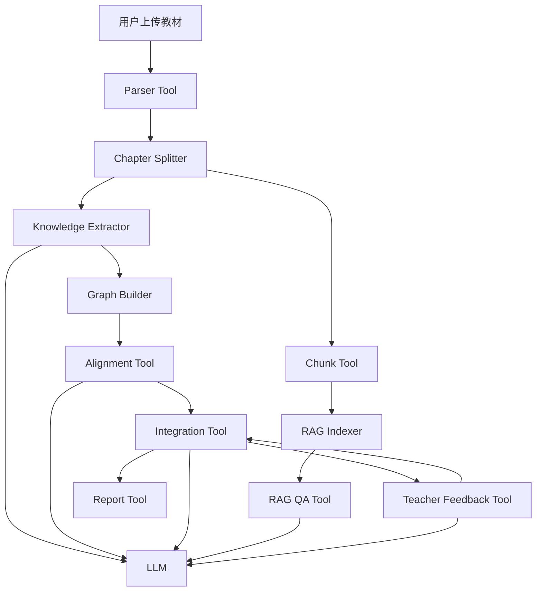

# Agent 架构说明

## 1. 架构总览

EduGraph Agent 采用“Controller Agent + Deterministic Tools + Lightweight GraphRAG”的架构。

这里的 Agent 不是完全自治的多智能体系统，而是一个受控编排层：LLM 负责知识抽取、等价判断、整合理由、RAG 回答和教师反馈意图解析；确定性工具负责文件解析、分块、存储、检索、图谱更新和统计计算。



## 2. 为什么选择这种架构

本项目的目标是在有限时间内完成可运行闭环。完全自治的多 Agent 架构会增加通信、状态同步和调试成本，而纯规则系统又无法处理医学概念的语义差异。

因此采用混合架构：

```text
LLM 处理语义不确定性。
工具代码处理工程确定性。
SQLite / JSON 负责可追溯状态。
前端工作台负责人机协同验证。
```

该架构的优点：

```text
1. 可调试：每一步都有明确输入输出。
2. 可回退：LLM 失败不会破坏解析和存储主链路。
3. 可复现：教材、章节、节点、决策都能落盘。
4. 可解释：每个整合决策都有 reason 和 confidence。
5. 适合比赛：优先完成 P0，后续再扩展 P1。
```

## 3. Agent 与工具职责

### 3.1 Controller Agent

Controller Agent 负责调度完整流程：

```text
parse
→ extract
→ build graph
→ align
→ integrate
→ index RAG
→ answer
→ revise decisions
→ report
```

它不直接修改底层数据，而是调用工具服务完成状态变更。

### 3.2 Parser Tool

负责多格式教材解析：

```text
输入：上传文件
输出：ParsedTextbook + Chapter
确定性逻辑：PyMuPDF、目录识别、正则切分、页码保留
```

### 3.3 Extractor Tool

负责知识点抽取：

```text
输入：章节标题、页码、正文片段
LLM 输出：nodes + edges JSON
输出：KnowledgeGraph
```

Prompt 约束：

```text
1. 只输出 JSON。
2. 不引入原文中不存在的知识点。
3. 关系类型限定为 prerequisite / parallel / contains / applies_to。
4. 内容不足时返回空数组。
```

### 3.4 Alignment Tool

负责跨教材语义对齐：

```text
第一步：embedding 召回候选节点对。
第二步：LLM 判断是否等价。
第三步：将等价节点归并为 group。
```

### 3.5 Integration Tool

负责生成整合决策：

```text
输入：等价知识点组、原始节点、原始边
输出：IntegrationDecision + IntegratedGraph
决策类型：merge / keep / remove / split / restore
```

### 3.6 RAG QA Tool

负责带引用问答：

```text
输入：用户问题
流程：query embedding → top-k chunks → LLM answer
输出：answer + citations + source_chunks
```

### 3.7 Teacher Feedback Tool

负责解析教师反馈：

```text
输入：自然语言反馈
输出：action JSON
动作：explain / split / restore / merge
```

## 4. 数据流与调用链路

### 4.1 上传教材到图谱构建

```text
POST /api/textbooks/upload
→ 保存文件
→ TextbookDB.status = uploaded

POST /api/textbooks/{book_id}/parse
→ Parser Service
→ ParsedTextbook JSON
→ ChapterDB
→ TextbookDB.status = parsed

POST /api/kg/build/{book_id}
→ Extractor Service
→ LLM JSON
→ KnowledgeNode / KnowledgeEdge
→ graph JSON
```

### 4.2 跨教材整合

```text
POST /api/integration/align
→ 加载多本教材 KnowledgeNode
→ text-embedding-v3
→ similarity candidates
→ LLM same/different
→ alignment_groups

POST /api/integration/run
→ Integration Tool
→ merge / keep / remove
→ IntegratedGraph
→ compression stats
```

### 4.3 RAG 问答

```text
POST /api/rag/index
→ parsed chapters
→ chunks
→ embedding
→ FAISS index

POST /api/rag/query
→ question embedding
→ top-k retrieval
→ prompt with context
→ LLM answer
→ citations
```

### 4.4 教师反馈

```text
POST /api/chat
→ Dialogue Service
→ LLM action JSON
→ update integration decisions
→ return reply + actions_taken
```

## 5. 关键接口输入输出

### 5.1 知识图谱构建

```text
POST /api/kg/build/{book_id}
```

输出：

```json
{
  "status": "built",
  "book_id": "book_03_生理学",
  "nodes": 128,
  "edges": 96
}
```

### 5.2 整合运行

```text
POST /api/integration/run
```

输出：

```json
{
  "status": "integrated",
  "original_nodes": 300,
  "integrated_nodes": 180,
  "compression_ratio": "28.7%",
  "decisions": 52
}
```

### 5.3 RAG 查询

```text
POST /api/rag/query
```

输入：

```json
{
  "question": "什么是炎症？"
}
```

输出：

```json
{
  "answer": "炎症是机体对损伤因子的防御性反应...",
  "citations": [
    {
      "textbook": "病理学",
      "chapter": "第四章 炎症",
      "page": 78,
      "relevance_score": 0.91
    }
  ],
  "source_chunks": []
}
```

## 6. 设计决策论证

### 6.1 单 Controller 而不是复杂多 Agent

本系统采用单 Controller 调度多个工具服务，而不是拆成多个自治 Agent。

原因：

```text
1. 任务链路清晰，不需要复杂协商。
2. 数据一致性比 Agent 自主性更重要。
3. 比赛评审更关注功能闭环和设计论证。
4. 单 Controller 更容易调试、回退和部署。
```

如果后续扩展，可将 Extractor、Alignment、RAG、Dialogue 拆成 LangGraph 节点，但不是 P0 必需条件。

### 6.2 JSON Graph / SQLite 而不是重型图数据库

默认采用 SQLite + JSON Graph。

原因：

```text
1. 无需额外数据库服务，部署稳定。
2. 当前图谱规模为教材级，SQLite 足够支撑。
3. 前端渲染需要的是 nodes / edges JSON。
4. 评审更容易复现。
```

Neo4j / Kuzu 可以作为高配路线。如果 Coding Agent 能稳定完成接入并带来查询或演示收益，可以直接升级。

### 6.3 text-embedding-v3 + FAISS

RAG 和对齐都需要语义检索。主方案使用 text-embedding-v3 和 FAISS。

原因：

```text
1. 中文医学教材语义匹配优于纯关键词。
2. 支持批量 embedding。
3. FAISS 本地检索速度快。
4. 与 OpenAI-compatible LLM 调用风格一致。
```

回退方案是 TF-IDF + cosine_similarity，保证 API 或 FAISS 不可用时仍可演示。

### 6.4 Thinking 模式按任务开关

qwen3.6-flash 支持 thinking 参数。本系统按任务控制：

| 任务 | thinking | 理由 |
|---|---|---|
| 知识点抽取 | off | 只需结构化 JSON，优先速度 |
| 对齐判断 | on | 需要判断概念是否等价 |
| 整合决策 | on | 需要解释 merge / keep / remove |
| RAG 问答 | off | 只基于上下文回答，避免发散 |
| 教师反馈 | on | 需要理解自然语言意图 |

## 7. Prompt 工程

Prompt 设计原则：

```text
1. 系统角色明确。
2. 输出格式严格 JSON。
3. 字段名固定。
4. 关系类型限定枚举。
5. 明确禁止引入原文外知识。
6. 找不到信息时返回空数组或固定回答。
```

知识抽取 Prompt 输出：

```json
{
  "nodes": [
    {
      "name": "炎症",
      "definition": "...",
      "category": "核心概念",
      "importance": 0.9
    }
  ],
  "edges": [
    {
      "source": "炎症",
      "target": "免疫应答",
      "relation_type": "applies_to",
      "description": "..."
    }
  ]
}
```

RAG Prompt 约束：

```text
只基于给定上下文回答。
每个关键结论带引用。
上下文没有答案时，回答“当前知识库中未找到相关信息”。
```

## 8. 已知局限

```text
1. PDF 章节识别依赖书签和规则，对无目录教材可能不稳定。
2. LLM 抽取质量受 prompt 和章节长度影响。
3. 医学概念跨书相关但不等价的情况较多，自动合并需要谨慎。
4. 目前压缩比采用概念级摘要口径，不等同于重写教材全文。
5. 教师反馈当前只支持有限 action，不是完全自由编辑器。
6. FAISS 或 embedding API 不可用时，检索质量会下降。
```

## 9. 改进方向

```text
1. 引入 BM25 + 向量混合检索和 rerank。
2. 建立 20-50 个 RAG benchmark 问题。
3. 增加图谱搜索、高亮和整合前后对比视图。
4. 将典型决策案例自动写入报告。
5. 引入 Docker Compose 一键部署。
6. 将教师反馈扩展为更细粒度的图谱编辑操作。
```

## 10. 创新点

```text
1. 教材知识图谱与 RAG 结合：图谱用于整合解释，原文 chunk 用于引用问答。
2. 跨教材对齐采用 embedding 召回 + LLM 复核，兼顾效率和准确性。
3. 教师反馈不是普通聊天，而是修改 integration decisions。
4. 压缩不是删除原文，而是构建可追溯的概念级精华知识库。
5. Thinking 模式按任务开关，在质量和成本之间做工程化权衡。
```

## 11. 实验与评估计划

基础评估：

```text
1. 解析成功率：7 本教材是否都能识别章节。
2. 图谱质量：每本教材节点数、边数、空节点比例。
3. 对齐质量：抽样检查 merge 决策是否合理。
4. RAG 引用准确率：答案引用是否来自相关章节。
5. 响应时间：抽取、整合、RAG 查询平均耗时。
```

P2 可扩展实验：

```text
chunk_size = 300 / 600 / 900 / 1200
指标 = top-5 命中率、引用准确率、平均响应时间、token 消耗
```

## 12. 待回填运行结果

```text
已解析教材数：
抽取教材数：
知识节点数：
关系边数：
整合决策数：
压缩比：
RAG 测试问题：
教师反馈案例：
最终部署链接：
```

