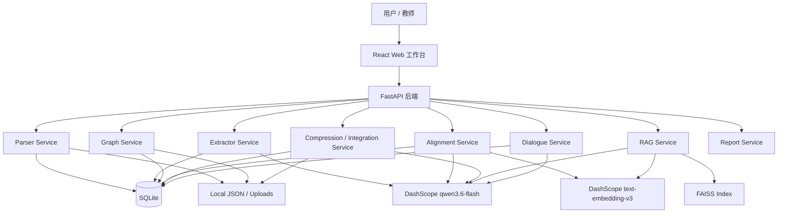

# 系统设计

## 1. 系统目标

EduGraph Agent 是一个面向多教材知识整合的 Web 工作台。系统围绕“教材解析、知识图谱、跨教材整合、RAG 问答、教师反馈、整合报告”六个核心功能构建。

目标是优先跑通可演示、可复现、可解释的工程闭环：

```text
上传教材
→ 解析章节
→ 抽取知识点和关系
→ 构建单书知识图谱
→ 跨教材语义对齐
→ 生成整合决策和压缩统计
→ 建立 RAG 索引
→ 带引用问答
→ 教师反馈修正
→ 生成整合报告
```

## 2. 总体架构



## 3. 技术选型

| 层级 | 选型 | 说明 |
|---|---|---|
| 前端框架 | React + Vite + JavaScript | 适合快速实现单页工作台 |
| UI 组件 | Ant Design | 表单、上传、Tabs、列表、状态展示效率高 |
| 图谱可视化 | Graphin / G6 | 支持节点拖拽、画布缩放、点击交互 |
| 统计图表 | ECharts | 用于压缩比、决策分布、token 统计 |
| 后端框架 | FastAPI | API 开发快，适合异步 LLM 调用 |
| 数据库 | SQLite + SQLAlchemy | 无外部服务依赖，适合比赛部署 |
| PDF 解析 | PyMuPDF | 支持 TOC、逐页文本、页码信息 |
| LLM | DashScope qwen3.6-flash | OpenAI-compatible，支持 JSON mode 和 thinking 开关 |
| Embedding | DashScope text-embedding-v3 | 中文效果较好，1024 维，批量输入 |
| 向量索引 | FAISS | 本地向量检索，轻量快速 |
| 回退检索 | sklearn TF-IDF | embedding 或 FAISS 不可用时保持可运行 |

## 4. 前端设计

前端采用单页工作台布局：

```text
左侧：教材管理
中间：知识图谱主视图
右侧：整合 / RAG / 对话 / 报告 Tab
顶部：系统状态、教材数、chunk 数、压缩比
```

核心交互：

```text
1. 上传多个文件并显示解析状态。
2. 点击教材触发解析和图谱构建。
3. 图谱支持缩放、拖拽、节点点击。
4. 节点详情展示名称、定义、章节、页码、来源。
5. 整合 Tab 展示 merge / keep / remove 决策和理由。
6. RAG Tab 展示回答、引用来源和原文 chunk。
7. 对话 Tab 支持教师反馈修改决策。
8. 报告 Tab 展示整合统计和典型案例。
```

## 5. 后端模块设计

### 5.1 Parser Service

职责：

```text
1. 接收上传文件。
2. 识别 PDF / TXT / Markdown。
3. 使用 PyMuPDF 逐页解析 PDF。
4. 优先使用 PDF 书签目录 get_toc()。
5. 无书签时使用目录页和“第X章”正则 fallback。
6. 输出 Textbook + Chapter 结构。
```

输出结构：

```json
{
  "textbook_id": "book_03_生理学",
  "filename": "03_生理学.pdf",
  "title": "生理学",
  "total_pages": 450,
  "total_chars": 613613,
  "chapters": []
}
```

### 5.2 Extractor Service

职责：

```text
1. 将章节按长度切片，避免单次 prompt 过长。
2. 调用 LLM 抽取 KnowledgeNode 和 KnowledgeEdge。
3. 强制 JSON mode。
4. 失败时跳过当前 segment，不中断全书处理。
5. 输出单本教材知识图谱。
```

关系类型：

```text
prerequisite
parallel
contains
applies_to
```

### 5.3 Alignment Service

职责：

```text
1. 收集多本教材的 KnowledgeNode。
2. 使用 text-embedding-v3 生成向量。
3. 使用余弦相似度召回跨教材候选节点对。
4. 对高相似候选调用 LLM 复核。
5. 输出等价知识点组。
```

默认阈值：

```text
embedding candidate threshold = 0.85
LLM same confidence threshold = 0.7
```

### 5.4 Integration Service

职责：

```text
1. 根据对齐组生成 merge / keep / remove 决策。
2. 为每项决策生成 reason 和 confidence。
3. 合并重复节点，保留来源映射。
4. 重新生成整合图谱。
5. 计算压缩比和节点数变化。
```

压缩比：

```text
compression_ratio = integrated_total_chars / original_total_chars
```

### 5.5 RAG Service

职责：

```text
1. 将章节正文切为 chunk。
2. 为 chunk 生成 embedding。
3. 建立 FAISS 索引。
4. 查询时检索 top-k chunk。
5. 将上下文注入 LLM prompt。
6. 返回 answer、citations、source_chunks。
```

回退策略：

```text
如果 FAISS 不可用，则使用 sklearn cosine_similarity。
如果 embedding API 不可用，则使用 TF-IDF。
接口返回结构保持不变。
```

### 5.6 Dialogue Service

职责：

```text
1. 保存同一会话内的对话历史。
2. 将教师自然语言解析为 action JSON。
3. 支持 split / restore / merge / explain。
4. 修改 integration_decisions 状态。
5. 触发前端刷新决策列表或图谱。
```

### 5.7 Report Service

职责：

```text
1. 汇总整合统计。
2. 提取典型整合案例。
3. 输出 Markdown 报告。
4. 保证报告数据与系统实际结果一致。
```

## 6. 数据模型

核心对象：

```text
Textbook
Chapter
Chunk
KnowledgeNode
KnowledgeEdge
IntegrationDecision
IntegrationResult
ChatMessage
Report
```

SQLite 表：

```text
textbooks
chapters
knowledge_nodes
knowledge_edges
integration_decisions
chat_messages
```

本地文件缓存：

```text
src/backend/data/textbooks    上传教材
src/backend/data/parsed       解析结果 JSON
src/backend/data/graphs       单书图谱 JSON
src/backend/data/integrated   整合结果 JSON
src/backend/data/index        RAG 索引
```

## 7. API 设计

### 教材接口

```text
POST /api/textbooks/upload
GET  /api/textbooks
GET  /api/textbooks/{book_id}
POST /api/textbooks/{book_id}/parse
POST /api/textbooks/parse-all
```

### 知识图谱接口

```text
POST /api/kg/build/{book_id}
GET  /api/kg/{book_id}
GET  /api/kg/merged
GET  /api/kg/visualization
```

### 整合接口

```text
POST /api/integration/align
POST /api/integration/run
GET  /api/integration/decisions
GET  /api/integration/stats
```

### RAG 接口

```text
POST /api/rag/index
GET  /api/rag/status
POST /api/rag/query
```

### 教师反馈接口

```text
POST /api/chat
GET  /api/chat/history/{session_id}
```

### 报告接口

```text
GET /api/report
```

## 8. 数据流

### 上传与解析

```text
前端上传文件
→ FastAPI 保存到 data/textbooks
→ TextbookDB 记录 uploaded
→ Parser Service 解析章节
→ parsed JSON + chapters DB
→ 前端展示章节结构
```

### 图谱构建

```text
前端选择教材
→ /api/kg/build/{book_id}
→ 加载 parsed textbook
→ Extractor Service 调用 LLM
→ 生成 nodes / edges
→ 保存 graph JSON 和 DB
→ 前端图谱展示
```

### 跨教材整合

```text
多本教材图谱
→ Alignment Service embedding 召回
→ LLM 判断等价
→ Integration Service 生成决策
→ IntegratedGraph + stats
→ 前端展示整合图谱和决策
```

### RAG 问答

```text
parsed chapters
→ chunk
→ embedding
→ FAISS index
→ query embedding
→ top-k chunks
→ LLM 生成回答
→ citations + source_chunks
```

### 教师反馈

```text
教师输入自然语言
→ Dialogue Service 解析 action
→ 修改 integration_result
→ 更新决策状态
→ 前端刷新
```

## 9. 错误处理与回退策略

| 风险 | 回退方案 |
|---|---|
| PDF 无书签 | 正则识别目录或整本书默认章节 |
| LLM JSON 解析失败 | JSON repair / 跳过当前 segment |
| Embedding API 失败 | TF-IDF 本地向量化 |
| FAISS 安装失败 | sklearn cosine_similarity |
| 图谱节点为空 | demo graph fallback |
| 整合结果不合理 | 教师反馈 split / restore |
| 部署失败 | 前端可演示 + 本地后端运行说明 |

## 10. 部署设计

本地开发：

```text
backend: uvicorn src.backend.main:app --reload --port 8000
frontend: npm run dev
```

环境变量：

```text
DASHSCOPE_API_KEY=
LLM_MODEL=qwen3.6-flash
LLM_BASE_URL=https://dashscope.aliyuncs.com/compatible-mode/v1
EMBEDDING_MODEL=text-embedding-v3
```

提交约束：

```text
不上传 PDF
不上传 .env
不上传 src/backend/data
不上传 node_modules
```

## 11. 待回填实现状态

```text
后端启动验证：
前端 build 验证：
7 本教材解析结果：
知识图谱构建结果：
整合结果：
RAG 查询样例：
教师反馈样例：
部署链接：
```

