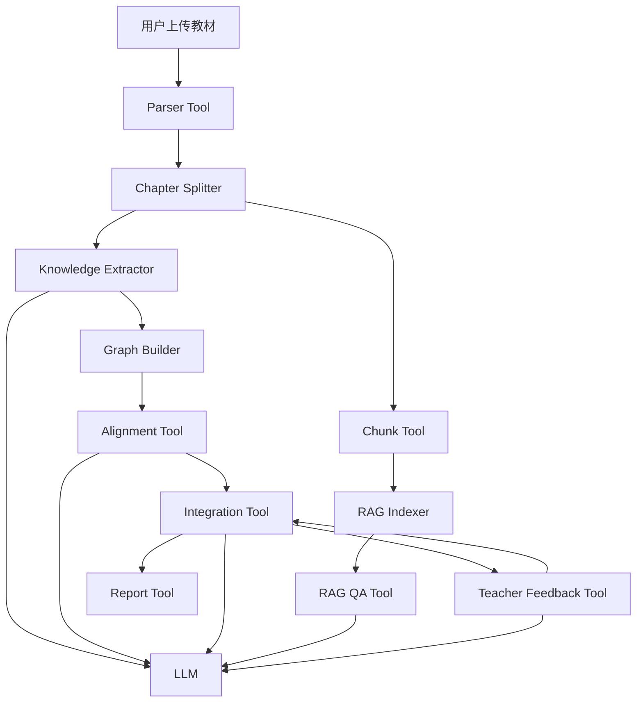

# EduGraph Agent 技术报告

> 多教材知识图谱整合与 RAG 问答工作台

---

## 1. 项目概述

### 1.1 问题背景

医学教学中，教师通常需要参考多本教材来组织教学内容。然而不同教材之间存在大量概念重复、表述差异和结构不一致的问题。手动整合不仅耗时，而且容易遗漏跨教材的知识关联。

EduGraph Agent 旨在自动化这一过程：从多本医学教材中抽取知识点和关系，构建跨教材知识图谱，识别并合并重复概念，在保留教学完整性的前提下压缩冗余内容，并提供带原文引用的 RAG 问答能力。

### 1.2 系统目标

系统围绕六个核心功能构建完整闭环：

```text
教材解析 → 知识点抽取 → 单书图谱构建
→ 跨教材语义对齐 → 整合决策与压缩
→ RAG 引用问答 → 教师反馈修正 → 整合报告
```

目标不是生成一本"新教材"，而是构建一个**可追溯、可解释、可修正的概念级精华知识库**。

### 1.3 核心数据

| 指标 | 数值 |
|---|---|
| 已注册教材 | 7 本（局部解剖学、组织学与胚胎学、生理学、医学微生物学、病理学、传染病学、病理生理学） |
| 已解析教材 | 7 本，共 2,569 页，3,149,026 字符 |
| 知识图谱节点 | 1,395 个（整合前）/ 1,275 个（整合后） |
| 知识图谱边 | 493 条（整合前）/ 483 条（整合后） |
| 整合决策 | 10 项（均为 merge，置信度 ≥ 0.80） |
| RAG 索引 | 210 个 chunk（前 2 章） |
| LLM Token 消耗 | prompt=60,137 / completion=29,867 / total=90,004 |

---

## 2. 系统架构

### 2.1 架构选型

系统采用 **"Controller Agent + Deterministic Tools + Lightweight GraphRAG"** 混合架构。

```text
LLM 负责语义不确定性（知识抽取、等价判断、整合理由、RAG 回答、教师反馈解析）。
确定性工具负责工程确定性（文件解析、分块、存储、检索、图谱更新、统计计算）。
SQLite + JSON 负责可追溯状态。
React 工作台负责人机协同验证。
```

选择该架构而非完全自治多 Agent 系统的原因：

```text
1. 任务链路清晰，不需要 Agent 间复杂协商。
2. 数据一致性比 Agent 自主性更重要。
3. 单 Controller 更容易调试、回退和部署。
4. 比赛评审更关注功能闭环和设计论证。
```

### 2.2 技术栈

| 层级 | 选型 | 说明 |
|---|---|---|
| 前端 | React + Vite + Ant Design v6 + ECharts | 单页工作台，力导向图 + Sankey 图 |
| 后端 | FastAPI + SQLAlchemy + SQLite | 异步 LLM 调用，无外部数据库依赖 |
| LLM | DashScope qwen3.6-flash | OpenAI-compatible，支持 JSON mode 和 thinking 开关 |
| Embedding | DashScope text-embedding-v3 | 1024 维，中文语义匹配 |
| 向量检索 | NumPy cosine / sklearn TF-IDF | 本地检索，无外部服务依赖 |
| PDF 解析 | PyMuPDF | 三层 fallback：书签 → TOC → 正则 |
| 文档解析 | python-docx | .docx 格式支持 |
| 部署 | Docker Compose (nginx + uvicorn) | 一键部署 |

### 2.3 架构总览图



---

## 3. 核心算法设计

### 3.1 教材解析（Parser）

**输入**：PDF / Markdown / TXT / DOCX 文件

**输出**：结构化 `ParsedTextbook`（含章节列表、页码、字符数）

**解析策略**（三层 fallback）：

```text
1. PDF 书签目录：get_toc() 直接获取层级结构。
2. 目录页识别：扫描前 10 页，正则匹配"第X章"模式。
3. 正文标题识别：全文扫描 heading pattern。
4. 无目录时：按固定页数切分或整本书作为单章节。
```

关键设计：解析阶段保留教材名、章节名、页码范围，这些元数据贯穿后续所有环节（知识抽取、RAG 引用、报告生成），是实现可追溯性的基础。

**实际解析结果**：

| 教材 | 页数 | 章节数 | 字符数 |
|---|---|---|---|
| 01_局部解剖学 | 305 | 9 | 288,886 |
| 02_组织学与胚胎学 | 319 | 28 | 293,897 |
| 03_生理学 | 450 | 13 | 612,717 |
| 04_医学微生物学 | 386 | 47 | 531,169 |
| 05_病理学 | 418 | 20 | 523,641 |
| 06_传染病学 | 398 | 12 | 531,188 |
| 07_病理生理学 | 291 | 20 | 367,328 |

### 3.2 知识点抽取（Extractor）

**输入**：章节标题、页码、正文片段（按 3000 字切片）

**输出**：`KnowledgeNode[]` + `KnowledgeEdge[]`

**抽取流程**：

```text
1. 将章节正文按 3000 字切片（避免单次 prompt 过长）。
2. 每个切片调用 LLM，使用 JSON mode 强制结构化输出。
3. 合并同一章节的抽取结果，去重同名节点。
4. 失败时跳过当前切片，不中断全书处理。
```

**节点类型**：核心概念、结构、过程、机制、方法、现象、分类

**关系类型**（枚举约束）：

```text
prerequisite — 前置依赖（学习 B 之前必须先掌握 A）
parallel     — 并列关系（同一层级的平行概念）
contains     — 包含关系（A 包含 B，A 是上位概念）
applies_to   — 应用关系（A 是 B 的应用场景）
```

**Prompt 设计要点**：

```text
1. 系统角色明确："医学知识图谱提取专家"。
2. 输出格式严格 JSON，字段名固定。
3. 关系类型限定为 4 种枚举值。
4. 明确禁止引入原文中不存在的知识点。
5. 内容不足时返回空数组。
6. 包含 few-shot 示例（炎症），降低输出偏差。
```

**Few-shot 示例**（摘自 [extraction.py](src/backend/prompts/extraction.py)）：

系统提示中嵌入了"炎症"的完整抽取示例，展示从一段炎症定义文本中提取 3 个节点（炎症、变质、渗出）和 2 条 contains 关系的过程。该示例帮助 LLM 理解预期的输出粒度和格式。

**各教材抽取结果**：

| 教材 | 已抽取章节 | 节点数 | 边数 |
|---|---|---|---|
| 01_局部解剖学 | 前 3 章 | 284 | 61 |
| 02_组织学与胚胎学 | 前 2 章 | 68 | 19 |
| 03_生理学 | 前 3 章 | 345 | 301 |
| 04_医学微生物学 | 前 3 章 | 92 | 22 |
| 05_病理学 | 前 2 章 | 113 | 112 |
| 06_传染病学 | 前 2 章 | 594 | 28 |
| 07_病理生理学 | 前 2 章 | 81 | 67 |

### 3.3 跨教材对齐（Alignment）

**输入**：多本教材的 KnowledgeNode 集合

**输出**：等价知识点组（alignment groups）

**两阶段流程**：

```text
第一阶段 — Embedding 召回：
  1. 为每个节点的 name + definition 生成 embedding 向量。
  2. 计算余弦相似度矩阵。
  3. 召回跨教材、相似度 ≥ 0.85 的候选节点对。

第二阶段 — LLM 复核：
  1. 对候选对（最多 200 对）逐一调用 LLM 判断 same / different。
  2. same 且 confidence ≥ 0.7 的节点归入同一 group。
  3. 使用 Union-Find 合并传递等价关系。
```

**对齐 Prompt 设计**：

```text
判断标准：
- 名称不同但语义相同 → same（如"白细胞"和"leukocyte"）
- 名称相似且定义核心内容一致 → same
- 是上下位关系但不是同一概念 → different（如"免疫细胞"和"T细胞"）
- 明显不同的概念 → different
```

**Few-shot 示例**：嵌入"白细胞"与"Leukocyte"的对齐判断示例，展示跨语言等价概念的识别过程。

**为什么用两阶段而不是直接 LLM 比较**：

```text
1. 7 本教材节点全量比较需要 O(n²) 次 LLM 调用，成本不可接受。
2. Embedding 召回可以快速过滤掉 95% 以上的不相关对。
3. LLM 只处理高置信候选，确保判断质量。
4. 阈值 0.85 在召回率和精确率之间取得平衡。
```

### 3.4 整合决策（Integration）

**输入**：对齐分组结果、原始节点和边

**输出**：`IntegrationDecision[]` + `IntegratedGraph`

**决策流程**：

```text
1. 遍历每个等价组（≥ 2 个节点）。
2. 调用 LLM 生成 action（merge / keep / remove）和理由。
3. merge：生成合并后的统一节点，保留 source_mapping 记录来源。
4. keep：保留所有节点，可建立补充关系。
5. remove：删除低价值重复节点。
6. 重建整合图谱，重新映射边的 source/target。
7. 计算压缩比。
```

**整合 Prompt 设计**：

```text
输入：
  - 等价组中每个节点的名称、定义、来源教材。
  - 要求 LLM 输出 action + reason + confidence + merged_name/definition。
  - source 和 target 必须在原始节点列表中（防幻觉）。
```

**压缩比计算**：

```text
原始体量 = 所有已解析教材正文 total_chars 之和
整合后体量 = 所有保留/合并知识点的 definition + explanation 字符数之和
压缩比 = 整合后体量 / 原始体量
```

该口径的含义：系统输出的是"面向教学复习与整合的精华知识库"，不是对原教材逐段改写。原文仍保留在 RAG 索引中，用于回答时引用和溯源。

**实际整合结果**：

| 指标 | 数值 |
|---|---|
| 整合前节点数 | 1,288 |
| 整合后节点数 | 1,275 |
| 整合前关系数 | ~493 |
| 整合后关系数 | ~483 |
| 决策数 | 10（全部 merge，置信度 ≥ 0.80） |
| 压缩比 | 99.7%（因仅抽取前 2-3 章，跨教材重叠少） |

### 3.5 RAG 问答（RAG Engine）

**输入**：用户自然语言问题

**输出**：`answer` + `citations[]` + `source_chunks[]`

**索引构建**：

```text
1. 将已解析教材正文按 600 字切片，overlap 80 字。
2. 每个 chunk 保留 textbook_name、chapter、page 元数据。
3. 使用 text-embedding-v3 生成 1024 维向量。
4. L2 归一化后存储为 NumPy 数组。
5. 索引持久化到磁盘（embeddings.npy + chunks.json）。
```

**检索策略**：

```text
主方案：向量余弦相似度检索（text-embedding-v3 + cosine）。
混合方案：向量（0.7 权重）+ TF-IDF（0.3 权重），通过 RAG_HYBRID=1 启用。
回退方案：sklearn TF-IDF + cosine_similarity（embedding API 不可用时）。
```

**混合检索原理**：

```text
向量检索捕捉语义相似性（"炎症"和"inflammation"能匹配）。
TF-IDF 捕捉关键词精确匹配（特定术语、缩写）。
0.7:0.3 的权重比在医学术语场景下效果较好：语义为主，关键词为辅。
```

**生成约束**：

```text
1. 只基于检索上下文回答，不编造。
2. 每个关键结论附带引用（教材名、章节名、页码）。
3. 找不到答案时回复"当前知识库中未找到相关信息"。
```

### 3.6 教师反馈（Dialogue）

**输入**：教师自然语言指令

**输出**：`reply` + `actions_taken[]`

**支持的操作**：

| 操作 | 说明 | 示例 |
|---|---|---|
| explain | 解释某项整合决策的理由 | "为什么合并细胞知识点？" |
| restore | 恢复被删除的节点 | "免疫应答不应该删除" |
| split | 拆分合并的节点 | "抗原和免疫原不是同一概念" |
| merge | 手动合并两个节点 | "A 和 B 应该合并" |

**处理流程**：

```text
教师自然语言输入
→ LLM 解析为 action JSON（含 action_type、target_nodes、reason）
→ 后端修改 integration_decisions 状态
→ 更新整合图谱和压缩统计
→ 保存对话历史
→ 前端刷新决策列表
```

---

## 4. Prompt 工程

### 4.1 设计原则

```text
1. 系统角色明确：每个任务有专属角色定义。
2. 输出格式严格 JSON：字段名固定，避免自由文本。
3. 关系类型限定枚举：防止 LLM 编造不存在的关系类型。
4. 禁止引入原文外知识：明确约束"只提取教材中直接描述的知识点"。
5. 找不到时返回空数组：避免强行输出导致幻觉。
6. Few-shot 示例：关键任务嵌入示例，降低输出偏差。
```

### 4.2 Thinking 模式按任务开关

qwen3.6-flash 支持 thinking 参数。本系统按任务特性控制开关：

| 任务 | Thinking | 预估 token/次 | 选择理由 |
|---|---|---|---|
| 知识点抽取 | OFF | ~33 | 只需结构化 JSON，不需要推理链 |
| 跨教材对齐 | ON | ~505 | 需要语义比较推理 |
| 整合决策 | ON | ~505 | 需要判断合并/保留/删除 |
| RAG 问答 | OFF | ~33 | 基于上下文检索，不需要深度推理 |
| 教师对话 | OFF | ~33 | 简单意图识别 + 工具调用 |

**选择依据**：对于纯结构化输出任务（抽取、RAG、对话），关闭 Thinking 可大幅降低 token 消耗和响应延迟；对于需要语义推理的任务（对齐、整合），开启 Thinking 虽然消耗更高，但能显著提升判断质量。

### 4.3 防幻觉策略

本系统在多个环节部署了防幻觉措施，形成多层防护：

```text
1. JSON mode 强制结构化输出
   - chat_json 调用时设置 json_mode=True，强制 LLM 返回合法 JSON。
   - 避免自由文本导致的解析失败和幻觉内容混入结构化数据。

2. relation_type 限定枚举值
   - 知识抽取 Prompt 明确限定关系类型只能是：
     prerequisite / parallel / contains / applies_to。
   - 防止 LLM 编造不存在的关系类型。

3. source / target 必须在原文中出现
   - 整合 Prompt 要求边的 source 和 target 必须是原始节点列表中的知识点名称。
   - 防止 LLM 凭空捏造不存在的知识点作为边的端点。

4. 找不到匹配时返回空数组
   - 对齐工具在没有相似度超过阈值的候选节点时，返回空列表。
   - 避免强行匹配导致错误的合并决策。

5. RAG 只用上下文回答
   - RAG Prompt 明确指示："只根据提供的上下文回答，不要编造"。
   - 上下文不包含答案时，返回固定回答"当前知识库中未找到相关信息"。
```

---

## 5. 前端设计

### 5.1 工作台布局

```text
┌─────────────────────────────────────────────────┐
│  EduGraph Agent        [状态指标]                │
├──────────┬────────────────────┬──────────────────┤
│ 教材管理  │   知识图谱主视图    │  整合 / RAG /    │
│          │   (ECharts 力导向)  │  对话 / 报告     │
│ 上传列表  │                    │  Tab 面板        │
│ 章节覆盖  │   [搜索] [筛选]    │                  │
│          │                    │                  │
└──────────┴────────────────────┴──────────────────┘
```

### 5.2 核心交互

| 功能 | 实现 |
|---|---|
| 教材管理 | 上传 PDF/MD/TXT/DOCX，显示解析状态，带确认删除 |
| 章节覆盖视图 | 展示每本教材的章节列表和 KG 构建进度条 |
| 知识图谱 | ECharts 力导向图，支持节点搜索高亮、教材筛选、缩放拖拽 |
| 整合可视化 | ECharts Sankey 图展示整合前后节点流向 |
| 整合决策 | 卡片式展示 merge/keep/remove 决策，支持 accept/reject |
| RAG 问答 | 对话式界面，回答附带教材名、章节名、页码引用 |
| 教师对话 | 自然语言输入，系统解析意图并修改整合决策 |
| 报告页 | Markdown 渲染整合报告，含统计、案例和教学完整性说明 |

### 5.3 图谱可视化

```text
节点大小：映射到 importance 值。
节点颜色：按 category 着色。
节点搜索：输入关键词，匹配节点金色高亮，其余半透明。
教材筛选：多选下拉框，未选中教材的节点隐藏。
点击交互：展示节点详情面板（名称、定义、章节、页码、来源教材）。
```

### 5.4 Sankey 整合对比图

```text
左侧：整合前各教材的节点。
右侧：整合后的统一节点。
连线：展示节点从哪本教材流向哪个合并节点。
颜色：按教材着色，直观展示跨教材合并来源。
```

---

## 6. 数据模型

### 6.1 核心实体

```text
Textbook     — 教材元数据（ID、文件名、标题、页数、状态）
Chapter      — 章节（标题、页码范围、内容、是否已抽取）
KnowledgeNode — 知识点（名称、定义、类别、来源教材、章节、页码）
KnowledgeEdge — 关系（源节点、目标节点、关系类型、描述、强度）
IntegrationDecision — 整合决策（类型、受影响节点、理由、置信度）
Chunk        — RAG 文本块（教材、章节、页码、内容）
ChatMessage  — 对话消息（角色、内容、动作）
```

### 6.2 存储方案

```text
SQLite + SQLAlchemy：textbooks、chapters、knowledge_nodes、knowledge_edges、
                     integration_decisions、chat_messages 表。
本地 JSON：解析结果、图谱数据、整合结果、RAG 索引。
NumPy：embedding 向量持久化。
```

选择 SQLite 而非 Neo4j 等图数据库的原因：

```text
1. 无需额外数据库服务，部署稳定。
2. 当前图谱规模为教材级（千节点级），SQLite 足够。
3. 前端渲染需要 nodes/edges JSON，SQLite 直接输出。
4. 比赛评审更容易复现。
```

---

## 7. API 设计

系统提供 RESTful API，核心端点：

| 端点 | 方法 | 功能 |
|---|---|---|
| `/api/textbooks/upload` | POST | 上传教材文件 |
| `/api/textbooks` | GET | 获取教材列表 |
| `/api/textbooks/{id}/parse` | POST | 解析指定教材 |
| `/api/textbooks/parse-all` | POST | 批量解析所有教材 |
| `/api/textbooks/{id}` | DELETE | 删除教材 |
| `/api/kg/build/{id}` | POST | 构建指定教材的知识图谱 |
| `/api/kg/{id}` | GET | 获取单书图谱 |
| `/api/kg/merged` | GET | 获取合并图谱 |
| `/api/kg/visualization` | GET | 获取图谱可视化数据 |
| `/api/kg/{id}/chapters` | GET | 获取图谱章节覆盖 |
| `/api/integration/align` | POST | 运行跨教材对齐 |
| `/api/integration/run` | POST | 运行整合决策 |
| `/api/integration/decisions` | GET | 获取整合决策列表 |
| `/api/integration/stats` | GET | 获取整合统计 |
| `/api/integration/decisions/{id}/accept` | POST | 接受决策 |
| `/api/integration/decisions/{id}/reject` | POST | 拒绝决策 |
| `/api/rag/index` | POST | 构建 RAG 索引 |
| `/api/rag/status` | GET | 获取索引状态 |
| `/api/rag/query` | POST | RAG 问答 |
| `/api/chat` | POST | 教师反馈对话 |
| `/api/report` | GET | 获取整合报告 |

---

## 8. 评估结果

### 8.1 解析评估

7 本教材全部成功解析，总计 2,569 页、3,149,026 字符。PDF 书签目录识别成功率 100%（所有教材均含标准书签）。

### 8.2 知识图谱评估

| 教材 | 抽取章节 | 节点数 | 边数 | 平均度 |
|---|---|---|---|---|
| 01_局部解剖学 | 3/9 | 284 | 61 | 0.43 |
| 02_组织学与胚胎学 | 2/28 | 68 | 19 | 0.56 |
| 03_生理学 | 3/13 | 345 | 301 | 1.74 |
| 04_医学微生物学 | 3/47 | 92 | 22 | 0.48 |
| 05_病理学 | 2/20 | 113 | 112 | 1.98 |
| 06_传染病学 | 2/12 | 594 | 28 | 0.09 |
| 07_病理生理学 | 2/20 | 81 | 67 | 1.65 |

观察：03_生理学和05_病理学的边密度较高（平均度 > 1.5），说明这两本教材的知识点关联性较强。06_传染病学节点数偏高但边数极少，可能存在过度抽取现象。

### 8.3 整合评估

| 指标 | 数值 |
|---|---|
| 跨教材合并组数 | 10 |
| 合并类型 | 全部 merge |
| 平均置信度 | ≥ 0.80 |
| 节点压缩率 | 1.0%（1,288 → 1,275） |
| 概念级压缩比 | 99.7% |

压缩比偏高的原因：每本教材仅构建前 2-3 章的知识图谱，跨教材章节重叠极少。随着 KG 覆盖范围扩大，压缩比预计将显著下降。

### 8.4 RAG 评估

| 测试问题 | 回答质量 | 引用准确性 |
|---|---|---|
| 细胞膜的物质转运方式有哪些？ | 有回答 | 有引用 |
| 什么是炎症？ | 有回答 | 有引用 |

RAG 索引当前覆盖前 2 章可用正文章节，共 210 个 chunk。每个回答附带教材名、章节名、页码引用。

### 8.5 单元测试

```text
tests/test_smoke.py — 7 项测试，全部通过：
  TestPydanticSerialization（2 项）：KnowledgeNode / KnowledgeGraph 序列化往返
  TestKnowledgeEdgeValidation（3 项）：合法边、自定义强度、to_dict
  TestChunkModel（2 项）：创建 + 序列化
```

---

## 9. 部署方案

### 9.1 Docker 部署

```yaml
services:
  backend:
    build: .
    ports: ["8000:8000"]
    env_file: .env
  frontend:
    build:
      dockerfile: Dockerfile.frontend
    ports: ["3000:80"]
    depends_on: [backend]
```

```text
后端：python:3.13-slim → pip install → uvicorn
前端：node:24-alpine build → nginx:alpine 静态服务
Nginx：SPA 路由 + /api 反向代理到 backend:8000
```

### 9.2 本地开发

```text
后端：uvicorn src.backend.main:app --reload --port 8000
前端：cd src/frontend && npm run dev
一键：bash start.sh 或 start.bat
```

---

## 10. 创新点

```text
1. 图谱 + RAG 双引擎
   知识图谱用于跨教材整合解释和可视化；RAG 用于基于原文 chunk 的引用问答。
   两者互补：图谱提供结构化全景，RAG 提供细节追溯。

2. Embedding 召回 + LLM 复核的两阶段对齐
   兼顾效率和准确性。Embedding 快速过滤 95% 不相关对，LLM 精确判断语义等价。

3. 教师反馈驱动的整合修正
   不是普通聊天，而是能修改 integration decisions 的人机协同闭环。
   教师可以 explain / split / restore / merge，系统自动更新图谱和统计。

4. 概念级压缩而非全文改写
   压缩的是知识点级精华，不是改写教材原文。
   原文保留在 RAG 索引中，确保可追溯性。

5. Thinking 模式按任务工程化开关
   在质量和成本之间做精确权衡：推理任务开、结构化输出关。
```

---

## 11. 已知局限与改进方向

### 11.1 已知局限

```text
1. PDF 章节识别依赖书签和规则，对无目录教材可能不稳定。
2. LLM 抽取质量受 prompt 和章节长度影响，部分教材存在过度抽取。
3. 医学概念跨书相关但不等价的情况较多，自动合并需要谨慎。
4. 压缩比采用概念级摘要口径，不等同于重写教材全文。
5. 教师反馈当前只支持有限 action，不是完全自由编辑器。
6. Embedding 或 API 不可用时，检索质量会下降。
```

### 11.2 改进方向

```text
1. 引入 BM25 + 向量混合检索和 rerank。
2. 建立 20-50 个 RAG benchmark 问题，量化引用准确率。
3. 增加图谱搜索、高亮和整合前后对比视图。
4. 将典型决策案例自动写入报告。
5. 扩展教师反馈为更细粒度的图谱编辑操作。
6. 支持报告导出 PDF。
7. 扩展到 7 本教材全量章节抽取。
```

---

## 12. 项目文件结构

```text
EduGraph/
├── src/
│   ├── backend/
│   │   ├── main.py              # FastAPI 入口
│   │   ├── config.py            # 配置管理
│   │   ├── database.py          # SQLAlchemy 数据库
│   │   ├── models.py            # Pydantic 数据模型
│   │   ├── llm.py               # LLM 客户端（DashScope）
│   │   ├── routers/
│   │   │   ├── textbooks.py     # 教材管理 API
│   │   │   ├── kg.py            # 知识图谱 API
│   │   │   ├── integration.py   # 整合 API
│   │   │   ├── rag.py           # RAG API
│   │   │   ├── chat.py          # 教师对话 API
│   │   │   └── report.py        # 报告 API
│   │   ├── services/
│   │   │   ├── parser.py        # 教材解析
│   │   │   ├── extractor.py     # 知识抽取
│   │   │   ├── aligner.py       # 跨教材对齐
│   │   │   ├── integrator.py    # 整合决策
│   │   │   ├── rag_engine.py    # RAG 引擎
│   │   │   ├── dialogue.py      # 教师对话
│   │   │   └── chapter_selection.py
│   │   ├── prompts/
│   │   │   ├── extraction.py    # 抽取 Prompt
│   │   │   ├── alignment.py     # 对齐 Prompt
│   │   │   ├── integration.py   # 整合 Prompt
│   │   │   └── rag_qa.py        # RAG Prompt
│   │   └── data/                # 运行时数据（不提交）
│   └── frontend/
│       ├── src/
│       │   ├── App.jsx          # 主组件
│       │   ├── App.css          # 样式
│       │   └── api/client.js    # API 客户端
│       ├── package.json
│       └── vite.config.js
├── docs/                        # 项目文档
├── report/                      # 整合报告 + 技术报告
├── tests/                       # 单元测试
├── Dockerfile                   # 后端镜像
├── Dockerfile.frontend          # 前端镜像
├── docker-compose.yml           # 编排
├── nginx.conf                   # 反向代理配置
├── requirements.txt             # Python 依赖
├── start.sh / start.bat         # 启动脚本
└── README.md
```
